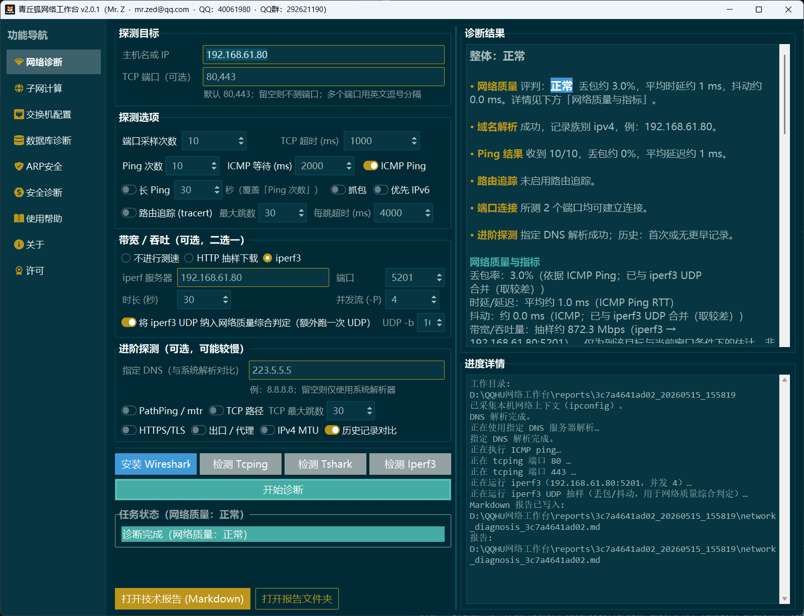
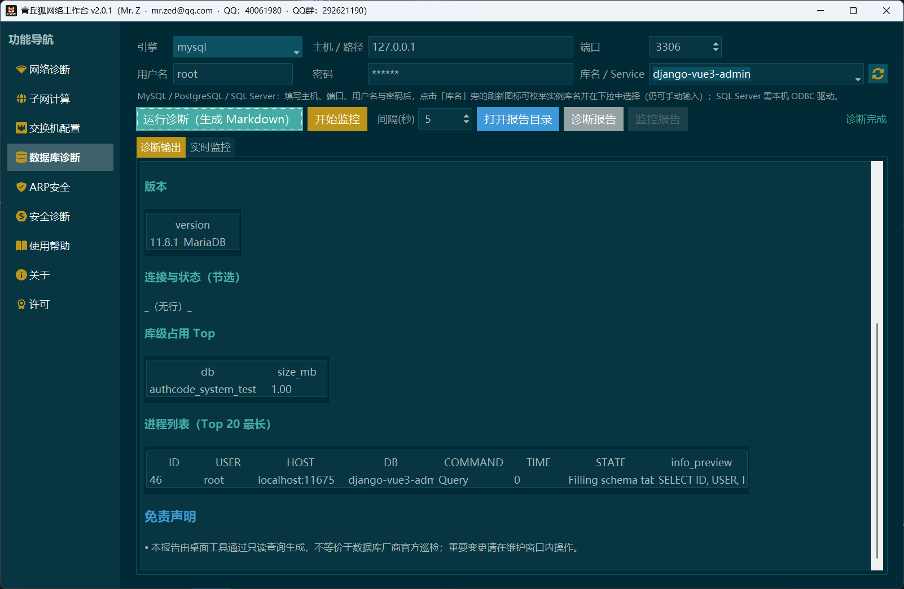
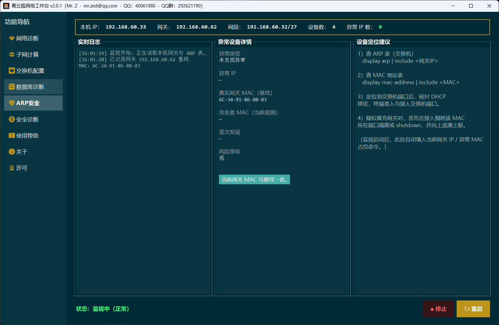
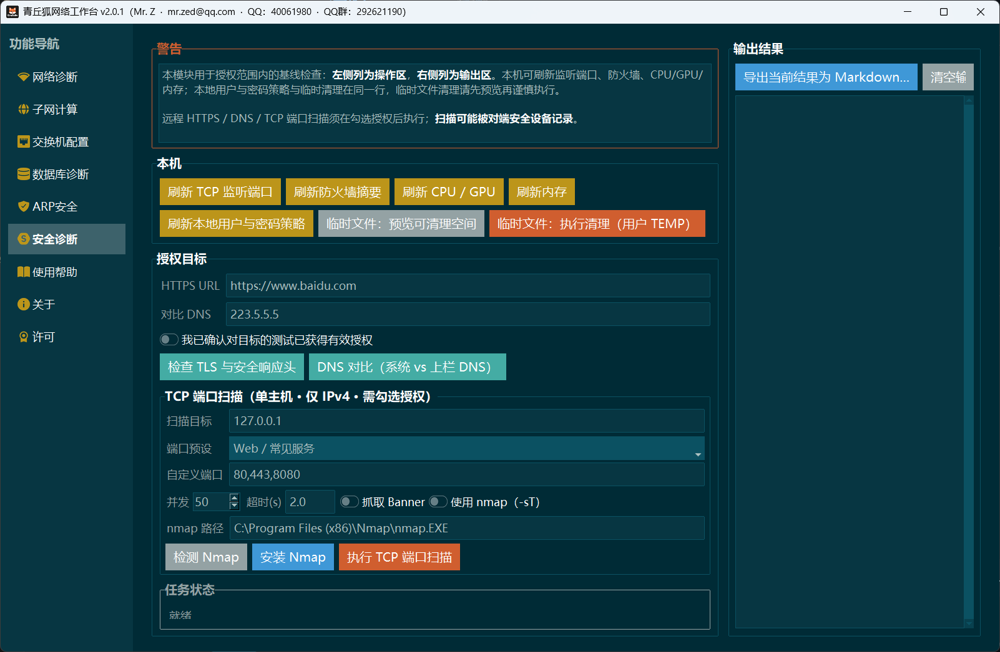
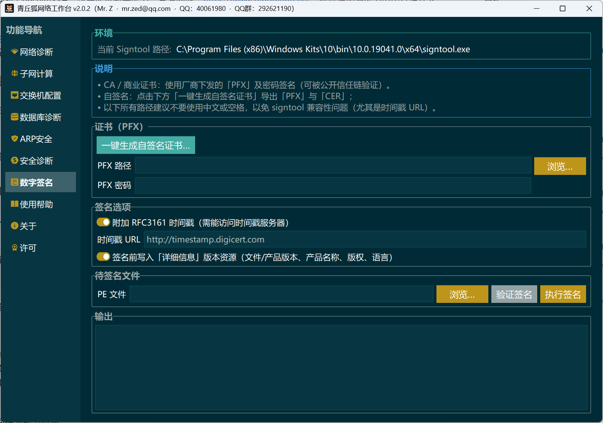

# Qingqiuhu Network Workbench

[Chinese (Simplified)](README.md)

> Prebuilt releases are available for download on GitHub: [Releases](https://github.com/UncleNiu-QingqiuHu/network_diagnosis/releases).

A **Windows desktop network workbench** built with Python (tkinter + [ttkbootstrap](https://github.com/israel-dryer/ttkbootstrap)): connectivity diagnostics, **security diagnostics (baseline)**, IPv4 subnet utilities, switch **Console/SSH**, database diagnostics, **ARP security monitoring**, and **Windows Authenticode signing**. Official site: <https://www.qingqiuhu.net>. Release version is defined by `APP_VERSION` in [`network_diagnosis/version.py`](network_diagnosis/version.py).

Product scope and behavior are defined by the design documents below (if your clone has no `docs/` folder, obtain the same filenames from a release bundle or your team):

- [`docs/network-diagnostic-tool-design_v1.5.md`](docs/network-diagnostic-tool-design_v1.5.md) (v1.4 archived alongside)
- Security diagnostics: [`docs/network-security-diagnosis-design.md`](docs/network-security-diagnosis-design.md)

## Feature overview

The main window uses a left-hand navigation rail with the following modules:

| Module | Description |
|--------|-------------|
| **Network diagnostics** | Dual output: operator-friendly GUI summary plus a full **Markdown** technical report per run (same underlying model). |
| **Subnet calculator** | IPv4 CIDR / dotted-mask math; refresh local IPv4, gateway, DNS, and public IP hints. |
| **Switch console** | Serial console or **SSH (PTY)**; SSH host keys land under the writable `switch_console/` tree. |
| **Database diagnostics** | **SQLite / MySQL / PostgreSQL / SQL Server / Oracle** connectivity and inventory-style checks, Markdown output; scheduled monitoring snapshots. |
| **ARP security** | Poll `arp -a`, baseline the **default gateway MAC**, and warn on suspicious drift (lightweight LAN-side watch). |
| **Security diagnostics** | Local TCP listeners and read-only Windows Firewall summary; CPU/GPU/memory/user policy and temp cleanup (Windows); with explicit consent—HTTPS TLS/certificates and security headers, DNS comparison, **single-host IPv4 TCP port scan** (Python by default, optional nmap `-sT`). See [`docs/network-security-diagnosis-design.md`](docs/network-security-diagnosis-design.md). Exports under `reports/security_diagnosis/`. |
| **Code signing** | Windows **Authenticode**: `signtool` + PFX to sign/verify exe and dll; self-signed code-signing PFX via **PowerShell / .NET** (requires `powershell.exe`); locate `signtool` from the Windows SDK or PATH. |
| **Help / About / License** | Built-in help (Markdown-capable body), About, and MIT license text; static tabs are built on **first visit** to shorten cold start. |

**Network diagnostics** probes (summary):

- Local network context (`ipconfig` parsing), DNS, optional ICMP `ping`, multi-port **tcping**, optional **tshark** capture (Wireshark / Npcap installed on the machine).
- Optional **Traceroute**, **PathPing**, **TCP traceroute**; optional **egress probe**, **IPv4 MTU** probe; optional target **HTTP(S)/TLS** probe.
- Throughput: **HTTP download benchmark** or **iperf3** (TCP/UDP, can feed the composite quality assessment); run history index defaults to `reports/_diagnosis_history.json` for same-target comparisons (can be disabled in the UI).
- **Dependency policy** (aligned with `network_diagnosis/paths.py` and the UI **Detect** action): `tcping.exe` is loaded **only** from `ThirdParty/tcping/tcping.exe` (not PATH); `tshark.exe` is resolved under `%ProgramFiles%\Wireshark\` and `%ProgramFiles(x86)%\Wireshark\`; **iperf3** prefers `ThirdParty/iperf3/iperf3.exe`, else PATH; you may ship the official Wireshark **installer** under `ThirdParty/Wireshark/` for guided install from the UI.

**Database diagnostics** notes:

- Non-SQLite engines need a reachable host and database name; **SQL Server** needs a local **ODBC driver** (`pyodbc`); for **Oracle**, use **Service Name** in the “database” field (`oracledb` thin mode).
- Python dependencies for all engines are declared in `pyproject.toml`; install a subset in your venv if you do not need every backend (optional dependency groups are a team policy choice—today the project installs the full set).

## Requirements

- Windows 10/11 (scripts and subprocess flags are tuned for Windows).
- **Python 3.10+** (matches `requires-python` in `pyproject.toml`).
- Place **`tcping.exe`** at `ThirdParty/tcping/tcping.exe` (otherwise TCP port checks degrade and the report notes it).
- Place **`tshark.exe`** under `ThirdParty/Wireshark/` (otherwise capture is unavailable).
- Place **`iperf3.exe`** under `ThirdParty/iperf3/` (otherwise iperf3 bandwidth mode is unavailable).
- Place **`nmap.exe`** under `ThirdParty/Nmap/` (otherwise the port-scan backend is unavailable).

## Screenshots







## Install and run

```powershell
cd E:\Workspace\qqhu_network_diagnosis   # use your clone path
python -m venv .venv
.\.venv\Scripts\activate
pip install -e .
```

Start the GUI:

```powershell
python -m network_diagnosis
```

Or the console entry point:

```powershell
network-diagnosis
```

## Windows packaging (PyInstaller)

Packaging conventions are in [`docs/network-diagnostic-tool-design_v1.5.md`](docs/network-diagnostic-tool-design_v1.5.md) (section on packaging and distribution). In frozen mode, `network_diagnosis.paths.bundle_root()` resolves to **`sys._MEIPASS`**, so **`ThirdParty/tcping/tcping.exe`** and bundled assets must be added with **`--add-data`** (or `datas` in a `.spec`); **`reports/`**, **`logs/`**, and **`switch_console/`** still live **next to the exe** (do not bundle them into `_MEIPASS`).

**Full-feature offline bundle (recommended)**: to ship **iperf3** bandwidth, the **security nmap backend**, and the in-app **MIT license** text offline, include the repo-root **`LICENSE`**, a populated **`ThirdParty/iperf3/`** (at least `iperf3.exe`), and **`ThirdParty/Nmap/`** as a **portable tree** (**`nmap.exe` plus sibling DLLs**—do not copy a lone exe). Third-party redistribution must follow each vendor’s license.

### 1. Environment

In the same venv where you ran `pip install -e .`:

```powershell
.\.venv\Scripts\activate
pip install pyinstaller
```

### 2. Recommended: `onedir`, no console

Run from the **repository root** (adjust paths). On Windows, `--add-data` is **`source;dest_inside_bundle`** (semicolon):

```powershell
cd E:\Workspace\qqhu_network_diagnosis

pyinstaller --noconfirm --windowed --onedir `
  --name qqhu-network-workbench `
  --paths . `
  --collect-all ttkbootstrap `
  --add-data "ThirdParty/tcping/tcping.exe;ThirdParty/tcping" `
  --add-data "network_diagnosis/images;network_diagnosis/images" `
  network_diagnosis/__main__.py
```

Output: `dist\qqhu-network-workbench\` with `qqhu-network-workbench.exe`. Smoke-test on a real machine before wide distribution (AV / policy quirks).

(**Images**: bundling the whole **`network_diagnosis/images`** directory picks up existing and future PNG/ICO assets—usually no per-file `--add-data` lines.)

**Wheel / sdist**: `[tool.setuptools.package-data]` maps `network_diagnosis = ["images/*"]`; `python -m build` ships **one level** under `images/`. If you nest deeper later, extend the glob (e.g. recursive patterns).

**Recommended extras (paths must exist; drop lines you cannot satisfy)**

```powershell
# Append to the PyInstaller command (or fold into a spec). Windows `--add-data`: source;relative_dest
--add-data "LICENSE;." `
--add-data "ThirdParty/iperf3;ThirdParty/iperf3" `
--add-data "ThirdParty/Nmap;ThirdParty/Nmap"
```

- **`LICENSE`**: the License tab reads `bundle_root()/LICENSE` (PyInstaller → `_MEIPASS` root).
- **iperf3**: folder must contain **`iperf3.exe`** (see [`network_diagnosis/paths.py`](network_diagnosis/paths.py)).
- **Nmap**: ship the **entire portable `ThirdParty/Nmap/`** (`nmap.exe` + DLLs) or “Use nmap” may fail to start.

**Other optional payloads**

- **Wireshark installer**: large; you may **omit** it from `_MEIPASS` and ship `ThirdParty\Wireshark\*.exe` beside the exe in a zip; the app resolves installers via `bundle_root()` per [`network_diagnosis/paths.py`](network_diagnosis/paths.py). To embed:  
  `--add-data "ThirdParty/Wireshark;ThirdParty/Wireshark"` (only if the folder exists and you intend to redistribute it)

If analysis misses optional DB drivers, add **`--hidden-import`**, e.g. `pymysql`, `psycopg`, `pyodbc`, `oracledb`, `paramiko`, `serial`.

### 3. Optional `onefile`

`--onefile` yields a single exe with slower cold start and higher AV false-positive risk; resource rules are the same.

### 4. Python wheel / sdist (library layout)

For an installable package without a desktop exe, from the repo root:

```powershell
pip install build
python -m build
```

**Wheel** and sdist land in `dist/`; after install, launch with **`network-diagnosis`** (`[project.entry-points.gui_scripts]` in `pyproject.toml`).

## Windows packaging (Nuitka, folder distribution)

Without **`--onefile`**, Nuitka produces a **standalone directory** (zip the folder)—generally better cold start and troubleshooting than onefile.

When not using PyInstaller, `bundle_root()` is inferred from **`network_diagnosis/paths.py`**, so **`--include-data-dir`** **right-hand** paths must mirror repo layout for **`ThirdParty/...`** and **`network_diagnosis/images/...`** (see [`network_diagnosis/paths.py`](network_diagnosis/paths.py)).

**Full-feature bundle (recommended)**: same as PyInstaller—ship **`LICENSE`**, **`ThirdParty/iperf3/`**, and the portable **`ThirdParty/Nmap/`** tree with the standalone output.

### 1. Toolchain

Windows needs a **C compiler** (Visual Studio Build Tools or MinGW per Nuitka docs). See the [Nuitka User Manual](https://nuitka.net/user-documentation/user-manual.html).

```powershell
.\.venv\Scripts\activate
pip install nuitka ordered-set zstandard
```

### 2. Standalone directory (recommended)

From the **repository root** (adjust paths):

```powershell
cd E:\Workspace\qqhu_network_diagnosis

python -m nuitka `
  --standalone `
  --assume-yes-for-downloads `
  --windows-console-mode=disable `
  --windows-icon-from-ico=network_diagnosis/images/qqhu_black2.ico `
  --enable-plugin=tk-inter `
  --include-package-data=ttkbootstrap `
  --include-data-dir=ThirdParty/tcping=ThirdParty/tcping `
  --include-data-dir=ThirdParty/iperf3=ThirdParty/iperf3 `
  --include-data-dir=ThirdParty/Nmap=ThirdParty/Nmap `
  --include-data-files=LICENSE=LICENSE `
  --include-data-dir=network_diagnosis/images=network_diagnosis/images `
  network_diagnosis/__main__.py
```

If **iperf3** or **Nmap** folders are missing, create them with binaries first, or **remove** the matching **`--include-data-dir=...`** lines (Nuitka errors on missing paths). **`LICENSE`** should always exist at the repo root.

**Exe icon**: **`--windows-icon-from-ico=...`** sets the **PE icon resource** (Explorer / taskbar). This is separate from **`--include-data-dir=network_diagnosis/images/...`**, which supplies runtime ICO for `try_set_window_icon`, etc. `--onefile` builds can use the same icon flag. Paths are relative to the working directory when you invoke Nuitka (repo root above). On Windows, `python -m nuitka --help | findstr /i icon` lists the exact flag names on your install.

Default output: **`__main__.dist`** containing **`__main__.exe`** and DLLs—zip the whole **`__main__.dist`**.

For a friendlier exe name, add **`launcher.py`** at the repo root that calls `main()` from `network_diagnosis.__main__`, then run Nuitka on **`launcher.py`**; expect **`launcher.dist` / `launcher.exe`** (confirm with `python -m nuitka --help` on your machine).

**`--include-data-dir` already in the sample**

- **iperf3**: `ThirdParty/iperf3/` with `iperf3.exe`
- **Nmap**: portable **`ThirdParty/Nmap/`** (`nmap.exe` + deps)
- **LICENSE**: `--include-data-files=LICENSE=LICENSE` (in-app license tab)

**Other optional `--include-data-dir`**

- **Wireshark installer**: if too large, place `ThirdParty\Wireshark\` beside the `.dist` folder in the zip instead of embedding; to embed:  
  `--include-data-dir=ThirdParty/Wireshark=ThirdParty/Wireshark`

If runtime complains about missing DB modules, add **`--include-module=...`** as needed (`pymysql`, `psycopg`, `pyodbc`, `oracledb`, …).

### 3. PyInstaller vs Nuitka

- Nuitka does **not** provide `sys._MEIPASS`; assets follow the published folder layout and `paths.py` heuristics.
- Like PyInstaller: **`reports/`**, **`logs/`**, **`switch_console/`** should be writable next to the shipped exe.
- **`--onefile`** exists for Nuitka too—slower startup and harder debugging; **prefer directory mode** for distribution.

## Reports, logs, and data directories

All conventions live in [`network_diagnosis/paths.py`](network_diagnosis/paths.py): **repo root** in development; **directory containing the exe** for PyInstaller / shipped binaries (never write into read-only `_MEIPASS`).

### Runtime logs

- Folder: **`logs/`** (same placement rules as `reports/`).
- Primary file: **`logs/app.log`**, rotated at **local midnight**, dated archives (`TimedRotatingFileHandler`, ~90 files retained by default).
- Code: **`network_diagnosis/runtime_log.py`** (`setup_runtime_logging()` early in GUI `main_gui()`); other modules can use `get_logger(__name__)` on the `qingqiuhu.*` tree.

### Diagnostic artifacts

Each **network diagnostics** run creates:

```text
reports/<short_task_id>_<timestamp>/
```

Markdown report, subprocess stdout/stderr logs, and optional pcap when capture is enabled. Same-target history (unless disabled) is indexed in **`reports/_diagnosis_history.json`**.

**Database diagnostics** and monitoring exports:

```text
reports/db_diagnosis/<task_id>/
```

**Security diagnostics** exports:

```text
reports/security_diagnosis/
```

**Switch console** writable data (e.g. SSH `known_hosts`): **`switch_console/`**.

Directories are created on first use; **`reports/`**, **`logs/`**, **`switch_console/`** are listed in `.gitignore`.

## Third-party assets

| Asset | Path | Notes |
|-------|------|-------|
| tcping | `ThirdParty/tcping/tcping.exe` | Required for full port checks; the app does not rely on PATH for tcping. |
| iperf3 | `ThirdParty/iperf3/iperf3.exe` | Optional; used when iperf3 bandwidth mode is selected; PATH fallback allowed. Recommended in full offline bundles (PyInstaller / Nuitka above). |
| Wireshark installer | `ThirdParty/Wireshark/*.exe` | Optional; UI can launch the installer when `tshark` is missing. |
| Nmap | `ThirdParty/Nmap/*.exe` (installer) or portable **`ThirdParty/Nmap/`** (`nmap.exe` + DLLs) | Optional; used when security diagnostics enables nmap; resolution order: PATH → default install dirs → `ThirdParty/Nmap/nmap.exe` (`paths.resolve_nmap_exe_path`). Ship the full portable folder when bundling. |
| LICENSE | repo root `LICENSE` | Read by the License tab; include in PyInstaller / Nuitka bundles per above. |

Redistributing third-party binaries must comply with their licenses (see design doc §6).

## Repository layout (excerpt)

```text
network_diagnosis/       # Python package: models, probes, orchestration, GUI, Markdown serialization
docs/                    # Design docs (may be absent in some clones)
readmeimgs/              # Screenshots for README
ThirdParty/              # tcping; optional iperf3 / Wireshark / Nmap; ship with root LICENSE for releases
reports/                 # Default diagnostic output (.gitignore)
logs/                    # app.log, daily rotation (.gitignore)
switch_console/          # SSH writable data (.gitignore; created on first use)
pyproject.toml
CHANGELOG.md
```

## Development

```powershell
.\.venv\Scripts\activate
pip install ruff
python -m ruff check network_diagnosis
```

## License

**MIT** — see [`LICENSE`](LICENSE) in the repository root.
