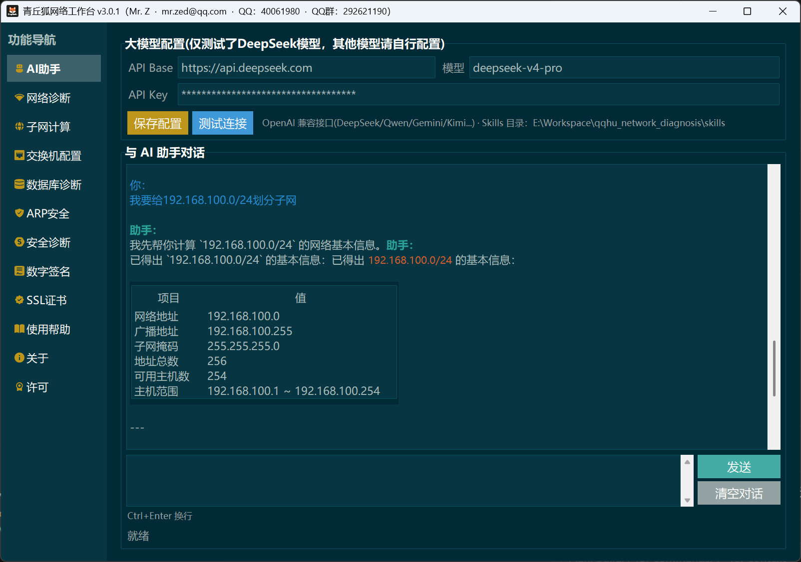
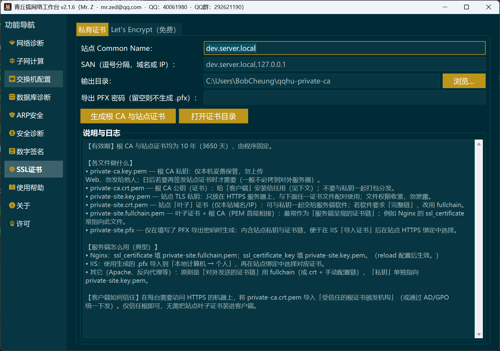

# 青丘狐网络工作台

[English README](README.en.md)

> 本仓库同时提供了发行版[Github发行版地址](https://github.com/UncleNiu-QingqiuHu/network_diagnosis/releases)/[GitCode发行版地址](https://gitcode.com/ibobcheung/qqhu_network_diagnosis/releases)以供下载。本仓库提供的发行版可执行程序（exe）通过 Nuitka 编译优化，已进行数字签名。

> 3.0.0 版本开始增加AI大模型调用，对AI大模型进行了优化，支持调用本工具的能力。当前仅测试了 DeepSeek 模型，仅适配了网络诊断、子网计算、数据库诊断功能。

**Windows 桌面网络工作台**（tkinter + [ttkbootstrap](https://github.com/israel-dryer/ttkbootstrap)），集成网络连通性诊断、**安全诊断（基线）**、子网计算、交换机 Console/SSH、数据库诊断、**ARP 安全监视**、**Windows 数字签名**、**SSL 证书（Let's Encrypt / 私有 CA）**等能力。官方网站：<https://www.qingqiuhu.net>。发布版本号以 [`network_diagnosis/version.py`](network_diagnosis/version.py) 中的 `APP_VERSION` 为准。

## 功能概览

主窗口左侧为功能导航，当前包含：

| 模块 | 说明 |
|------|------|
| **AI助手** | 自然语言对话驱动本机能力：大模型配置、流式回复、Markdown 渲染、**Skills** 扩展；可自动执行网络诊断、子网计算、数据库诊断等（详见 [`docs/ai-assistant.md`](docs/ai-assistant.md)）。 |
| **网络诊断** | 双输出：面向非技术用户的 GUI 摘要 + 每次任务一份完整 **Markdown** 技术报告（同源数据模型）。 |
| **子网计算** | IPv4 CIDR / 点分掩码计算；可刷新本机 IPv4、网关、DNS 与公网地址参考信息。 |
| **交换机配置** | 串口 Console 或 **SSH（PTY）** 会话；SSH 未知主机密钥写入可写目录下的 `switch_console/`。 |
| **数据库诊断** | 连接 **SQLite / MySQL / PostgreSQL / SQL Server / Oracle**，运行连通性与信息收集，输出 Markdown；支持周期性监控快照导出。 |
| **ARP 安全** | 以 `arp -a` 轮询本机 ARP 表，对**默认网关 MAC** 做基线对比；异常变化时提示疑似 ARP 欺骗（内网侧轻量监视）。 |
| **安全诊断** | 本机 TCP 监听与 Windows 防火墙只读摘要；本机 CPU/GPU/内存/用户策略与临时清理（Windows）；授权前提下 HTTPS TLS/证书与安全响应头、DNS 对比、**单主机 IPv4 TCP 端口扫描**（Python 默认可选 nmap `-sT`）；详见 [`docs/network-security-diagnosis-design.md`](docs/network-security-diagnosis-design.md)。导出至 `reports/security_diagnosis/`。 |
| **数字签名** | Windows **Authenticode**：`signtool` + PFX 对 exe/dll **仅签名与校验**；exe「详细信息」请在 **Nuitka/PyInstaller 构建时**写入。自签名 PFX 由 **PowerShell / .NET** 一键生成；`signtool` 来自 Windows SDK 或 PATH。 |
| **SSL证书** | **Let's Encrypt**（DNS-01，阿里云 / 腾讯云 DNS API）与 **私有 CA**（`cryptography`）；详见内置「SSL证书」帮助与 [`docs/ssl_certificate_scheme.md`](docs/ssl_certificate_scheme.md)。 |
| **使用帮助 / 关于 / 许可** | 内置帮助（正文支持 Markdown 渲染）、关于与 MIT 许可原文；静态页在 **首次进入对应导航时** 再构建，以缩短冷启动。 |

**网络诊断**探测能力简述：

- 本机网络上下文（`ipconfig` 解析）、DNS、可选 ICMP `ping`、多端口 **tcping**、可选 **tshark** 抓包（需本机安装 Wireshark / Npcap）。
- 可选 **Traceroute**、**PathPing**、**TCP Traceroute**；可选 **出口探测**、**IPv4 MTU** 探测；可选对目标的 **HTTP(S)/TLS** 探针。
- 带宽：**HTTP 下载测速** 或 **iperf3**（TCP/UDP，可与网络质量综合判定联动）；历史任务索引默认写入 `reports/_diagnosis_history.json`，支持同目标多次报告对比（可在界面关闭）。
- **依赖策略（与 `network_diagnosis/paths.py`、界面「检测」按钮一致）**：`tcping.exe` **仅**从 `ThirdParty/tcping/tcping.exe` 加载（不使用 PATH）；`tshark.exe` 探测 `%ProgramFiles%\Wireshark\` 与 `%ProgramFiles(x86)%\Wireshark\`；**iperf3** 优先 `ThirdParty/iperf3/iperf3.exe`，否则查找 PATH；可选将 Wireshark **官方安装包** 放入 `ThirdParty/Wireshark/` 由界面引导安装。

**数据库诊断**补充：

- 连接非 SQLite 时需填写可达主机与库名；**SQL Server** 依赖本机 **ODBC 驱动**（`pyodbc`）；**Oracle** 的「库名」请填 **Service Name**（`oracledb` 瘦模式）。
- 各引擎 Python 依赖已在 `pyproject.toml` 中声明；若某引擎暂不使用，可在本地虚拟环境中按需安装子集（团队可自行拆可选依赖组，当前为整包安装）。

## 环境要求

- Windows 10/11（当前脚本与子进程参数按 Windows 优化）。
- **Python 3.10+**（与 `pyproject.toml` 中 `requires-python` 一致）。
- 将 **`tcping.exe`** 放到 `ThirdParty/tcping/tcping.exe`（否则端口探测会降级并在报告中说明）。
- 将 **`tshark.exe`** 放到 `ThirdParty/Wireshark/`（否则抓包功能不可用）。
- 将 **`iperf3.exe`** 放到 `ThirdParty/iperf3/`（否则带宽测速功能不可用）。
- 将 **`nmap.exe`** 放到 `ThirdParty/Nmap/`（否则端口扫描功能不可用）。

## 界面截图






## 安装与运行

```powershell
cd E:\Workspace\qqhu_network_diagnosis   # 换成你的克隆路径
python -m venv .venv
.\.venv\Scripts\activate
pip install -e .
```

启动 GUI：

```powershell
python -m network_diagnosis
```

或使用控制台入口：

```powershell
network-diagnosis
```

## 打包与分发

将程序打成 **PyInstaller / Nuitka** 可执行包, 推荐使用 **Nuitka**。

## 报告、运行日志与数据目录

约定均实现于 [`network_diagnosis/paths.py`](network_diagnosis/paths.py)：开发时为**仓库根目录**；**PyInstaller / 打包 exe** 时为 **exe 所在目录**（勿写入只读的 `_MEIPASS`）。

### 运行日志

- 目录：**`logs/`**（与 `reports/` 同级规则）。
- 主文件：**`logs/app.log`**，按**自然日午夜**轮转，历史文件带日期后缀（由 `TimedRotatingFileHandler` 管理，默认保留约 90 份）。
- 代码入口：**`network_diagnosis/runtime_log.py`**（`setup_runtime_logging()` 在 GUI `main_gui()` 启动早期调用）；其它模块可使用 `get_logger(__name__)` 写入同一日志树（`qingqiuhu.*`）。

### 诊断报告与其它可写数据

**网络诊断**每次任务会创建：

```text
reports/<任务短ID>_<时间戳>/
```

其中包含 Markdown 报告、各子进程 stdout/stderr 日志，以及（若启用抓包）pcap 等文件。同目标历史索引（若未关闭）位于 **`reports/_diagnosis_history.json`**。

**数据库诊断**与监控导出的 Markdown 位于：

```text
reports/db_diagnosis/<任务ID>/
```

**安全诊断**导出的 Markdown 位于：

```text
reports/security_diagnosis/
```

**交换机 Console**（如 SSH `known_hosts`）默认可写目录：**`switch_console/`**。

以上目录若不存在会在首次使用时创建；**`reports/`、`logs/`、`switch_console/`** 已加入 `.gitignore`。

## 第三方资源

| 资源 | 路径 | 说明 |
|------|------|------|
| tcping | `ThirdParty/tcping/tcping.exe` | 必放；应用不依赖系统 PATH。 |
| iperf3 | `ThirdParty/iperf3/iperf3.exe` | 可选；网络诊断选择「iperf3」带宽时使用；亦可依赖系统 PATH。完整离线包建议随包放置，见 [docs/packaging.md](docs/packaging.md)。 |
| Wireshark 安装包 | `ThirdParty/Wireshark/*.exe` | 可选；未检测到 `tshark` 时可在界面中打开安装。 |
| Nmap | `ThirdParty/Nmap/*.exe`（安装包）或便携 **`ThirdParty/Nmap/` 整目录**（含 `nmap.exe` 及 DLL） | 可选；安全诊断勾选「使用 nmap」时使用；探测顺序为 PATH → 默认安装目录 → `ThirdParty/Nmap/nmap.exe`（见 `paths.resolve_nmap_exe_path`）。离线包请带入完整便携目录，见 [docs/packaging.md](docs/packaging.md)。 |
| LICENSE | 仓库根 `LICENSE` | 内置「许可」页读取；打包时请一并打入发行包，见 [docs/packaging.md](docs/packaging.md)。 |

再分发第三方软件须遵守各自许可证（详见设计文档第 6 节）。

## 仓库结构（节选）

```text
network_diagnosis/       # Python 包：模型、探针、编排、GUI、Markdown 序列化
readmeimgs/              # README 用界面截图
ThirdParty/              # tcping、可选 iperf3 / Wireshark / Nmap；打包时建议连同根目录 LICENSE 一并分发
reports/                 # 默认诊断输出（已加入 .gitignore）
logs/                    # 运行日志 app.log（按日轮转；已加入 .gitignore）
switch_console/          # SSH 等可写数据（已加入 .gitignore；首次运行创建）
pyproject.toml
CHANGELOG.md
```

## 开发

```powershell
.\.venv\Scripts\activate
pip install ruff
python -m ruff check network_diagnosis
```

## 许可证

MIT

见仓库根目录 [`LICENSE`](LICENSE)。
