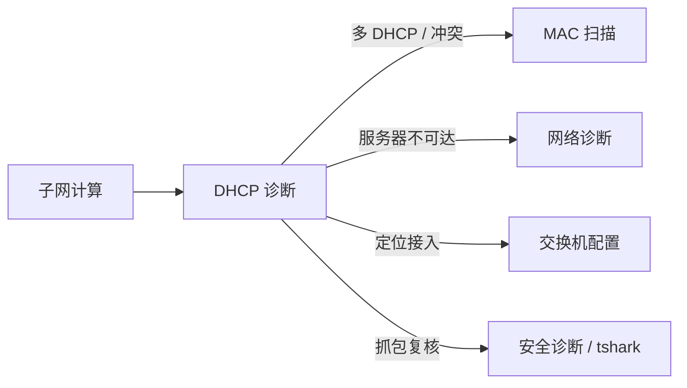

# DHCP 诊断模块 — 设计草案

> 文档版本：v0.1（草案）  
> 适用产品：青丘狐网络工作台（Windows 桌面）  
> 状态：**已实现（v3.2+）**  
> 关联模块：子网计算、IP/MAC 扫描、ARP 安全、网络诊断、交换机配置、安全诊断（Nmap）

---

## 1. 背景与目标

### 1.1 要解决的问题

内网运维中常见与 DHCP 相关的故障：

| 现象 | 可能原因 |
|------|----------|
| 获取 169.254.x.x（APIPA） | DHCP 无响应、链路/VLAN 错误、作用域耗尽 |
| 地址有了但网关/DNS 异常 | 错作用域、**非法 DHCP 分配**、静态配置错误 |
| 间歇断网、时好时坏 | 租约异常、**多 DHCP 争抢**、IP 冲突 |
| 本机配置「看起来正常」但业务不通 | 静态 IP 落在错误网段、DNS 被污染 DHCP 改写 |

当前工具已通过 `ipconfig /all`、子网计算、MAC 扫描等覆盖部分场景，但 **缺少面向 DHCP 的系统化诊断**，尤其缺少对 **多 DHCP 服务器（DHCP 污染 / Rogue DHCP）** 的检测与告警。

### 1.2 模块目标

1. **本机 DHCP 客户端诊断**：地址来源、租约、网关/DNS、APIPA、事件日志摘要。  
2. **网段 DHCP 服务探测（授权前提下）**：在同一广播域内发现 **响应 DHCP DISCOVER 的服务器**，识别 **是否存在多个 DHCP 服务器**。  
3. **结论与证据**：GUI 摘要 + 可导出 Markdown 报告，便于留档与交接。  
4. **联动排障**：一键跳转 MAC 扫描、网络诊断、交换机配置。

### 1.3 非目标（首版不做）

- 替代 Windows DHCP 控制台进行租约增删改。  
- 默认对全网连续发起大规模 DHCP 泛洪。  
- 在非 Windows 平台提供完整能力（可提示「仅 Windows」）。  
- 无凭据情况下读取企业路由器/Windows Server 上完整租约库（列为后续可选连接器）。

---

## 2. 术语

| 术语 | 说明 |
|------|------|
| **DHCP 污染** | 同一广播域内出现 **多个 DHCP 服务器** 响应客户端请求；客户端可能拿到 **错误网关/DNS**，导致断网、劫持或间歇故障。也称 Rogue DHCP、非法 DHCP。 |
| **权威 DHCP** | 网管登记的合法服务器（通常 1 台主用 + 可选热备；热备应对外呈现 **相同作用域策略**，见 §5.4）。 |
| **Server Identifier** | DHCP 选项 **60/54**（实现中统一提取 OFFER 报文中的 **DHCP Server Identifier / siaddr**），用于区分不同 DHCP 实例。 |
| **本机绑定接口** | 与 MAC 扫描一致：诊断与探测绑在本机 **已连接网段的某一 IPv4 接口** 上。 |

---

## 3. 模块定位与导航

### 3.1 建议入口

- 左侧导航新增：**「DHCP 诊断」**  
- `module_key` 建议：`dhcp_diagnosis`  
- 位置建议：介于 **「MAC 扫描」** 与 **「交换机配置」** 之间（与二层/三层排障路径相邻）。

### 3.2 与其它模块关系



| 场景 | 推荐路径 |
|------|----------|
| 怀疑 DHCP 污染 | **DHCP 诊断**（多服务器探测）→ 记录非法 Server ID → **交换机配置** 查 MAC/端口 |
| 拿到错网段地址 | **DHCP 诊断**（本机摘要 + 多 DHCP）→ **子网计算** 核对 CIDR |
| 固定 IP 与 DHCP 池重叠 | **DHCP 诊断** + **MAC 扫描** |
| 仅本机拿不到地址 | **DHCP 诊断**（客户端 + 事件日志）→ Ping 默认网关 / DHCP 服务器 |

---

## 4. 功能分层

### 4.1 层级 A — 本机 DHCP 客户端诊断（只读，MVP 必做）

**数据来源**

| 来源 | 内容 |
|------|------|
| `ipconfig /all` | DHCP 是否启用、IPv4、掩码、网关、DNS、**DHCP 服务器**、租约获得/到期 |
| WMI/CIM / `Get-NetIPConfiguration` | 地址来源（Dhcp / Manual）、接口别名、连接状态 |
| 事件日志 `Microsoft-Windows-Dhcp-Client/Operational` | 最近 N 条：获取失败、拒绝、超时、无响应 |
| 路由表 | 到 DHCP 服务器、默认网关是否可达 |

**扩展 `AdapterIPv4Block`（或新建 `DhcpClientSnapshot`）建议字段**

```text
interface_name          # 适配器描述
mac                     # 规范化 MAC
ipv4 / netmask
address_source          # dhcp | manual | apipa | unknown
dhcp_enabled            # bool
dhcp_server             # ipconfig 显示的 DHCP 服务器（本机当前租约来源）
lease_obtained          # datetime | null
lease_expires           # datetime | null
gateways / dns_servers
is_apipa                # 169.254.0.0/16
health_flags            # 规则引擎输出
```

**规则示例（health_flags）**

- `APIPA`：地址在 169.254.0.0/16  
- `LEASE_EXPIRED`：租约已过期（若可解析）  
- `LEASE_EXPIRING_SOON`：剩余 < 10% 或 < 1 小时（可配置）  
- `NO_DHCP_SERVER`：DHCP 启用但 ipconfig 无服务器字段  
- `DHCP_SERVER_UNREACHABLE`：Ping 不通 DHCP 服务器  
- `STATIC_ON_DHCP_SCOPE`：手动 IP 落在用户指定的 DHCP 池内（可选，需用户输入池范围）  
- `DNS_EMPTY` / `GATEWAY_EMPTY`  

### 4.2 层级 B — 多 DHCP 服务器探测（DHCP 污染检测，MVP 必做）

> **核心关注点**：在同一 L2 广播域内，一次或多次探测中若收到 **多个不同 DHCP Server Identifier 的 OFFER**，则标记 **「疑似 DHCP 污染（多 DHCP 服务器）」**。

#### 4.2.1 探测原理

1. 在本机选定接口所属网段发送 **DHCP DISCOVER**（UDP 广播：`255.255.255.255:67` 或子网广播地址）。  
2. 监听 **DHCP OFFER**（UDP 本机 68 或抓包/Nmap 脚本代为接收）。  
3. 在超时窗口（建议 **3–5 秒**）内汇总所有 OFFER 的：  
   - **Server Identifier**（选项 54，优先）  
   - **Your IP / yiaddr**（分配建议地址）  
   - **Router（选项 3）**、**DNS（选项 6）**（若存在）  
   - **响应来源 IP**（部分设备 siaddr 与选项 54 不一致时均记录）  
4. 对 Server Identifier **去重**；若 distinct 数量 **≥ 2** → 触发 **`MULTIPLE_DHCP_SERVERS`** 告警。

#### 4.2.2 实现路径（按优先级）

| 方案 | 说明 | 依赖 |
|------|------|------|
| **B1 — Nmap 脚本（推荐首选）** | `nmap --script broadcast-dhcp-discover` 或 `dhcp-discover`；项目已有 Nmap 探测与安全诊断集成 | `ThirdParty/Nmap` 或系统 PATH |
| **B2 — Scapy / 原始 UDP** | 自行组 DISCOVER、收 OFFER | Npcap（与 Wireshark 生态一致） |
| **B3 — tshark 抓包 + 触发 renew** | 用户确认后 `ipconfig /renew`，分析 DHCP 报文 | Wireshark/tshark |

**首版建议**：优先 **B1**（与现有「检测 Nmap」一致）；Nmap 不可用时降级提示安装，**不静默失败**。

#### 4.2.3 探测参数（GUI）

| 参数 | 默认 | 说明 |
|------|------|------|
| 绑定接口 | 自动（与子网/MAC 扫描同源） | 必须在本机所在网段 |
| 重复轮次 | 3 | 间隔 1–2 s，降低「偶发双响应」误报 |
| 单轮超时 | 4 s | |
| 并发 | 1 | 避免对 DHCP 池造成压力 |
| **授权确认** | 未勾选不可探测 | 与 IP/MAC 扫描一致 |

#### 4.2.4 权威服务器白名单（强烈建议）

用户可配置 **「合法 DHCP 服务器 IPv4 列表」**（存 `config/dhcp_diagnosis.json`）：

```json
{
  "authorized_dhcp_servers": ["192.168.60.1"],
  "dhcp_scope_cidr": "192.168.60.0/27"
}
```

判定逻辑：

| 探测结果 | 结论 |
|----------|------|
| 仅 1 个 Server ID，且在白名单内 | 正常 |
| 仅 1 个 Server ID，不在白名单 | **未知 DHCP 服务器**（中危） |
| ≥ 2 个 Server ID | **疑似 DHCP 污染**（高危） |
| 白名单内服务器未出现，但出现其它 ID | **非法 DHCP 疑似抢答**（高危） |

#### 4.2.5 热备与高可用（避免误报）

- **Windows DHCP 故障转移 / 双机热备**：两台服务器可能 **轮流** OFFER，但 Server Identifier 通常为 **两台不同 IP**，会被判为「多 DHCP」。  
- 文档与 UI 说明：若网络设计为 **双 DHCP 热备**，白名单应 **同时填入两台**，且两台分配的 **网关/DNS/掩码应一致**；规则引擎增加：  
  - **`MULTIPLE_DHCP_SERVERS_HA`**：≥2 个 ID 但 **全部在白名单** 且 **选项 3/6/掩码一致** → 降级为「信息」而非高危。  
- **IP 助手（IP Helper）中继**：OFFER 的 Server Identifier 可能是 **真实 DHCP 服务器** 而非中继地址；需记录 **giaddr**（若可见）并在报告中标注。

#### 4.2.6 输出示例（多 DHCP）

```text
【DHCP 服务探测】网段 192.168.60.0/27，接口 192.168.60.33

轮次 1（4s 内收到 2 个 OFFER）：
  - Server ID 192.168.60.1  → 建议地址 192.168.60.40，网关 192.168.60.1，DNS 192.168.60.1  [白名单 ✓]
  - Server ID 192.168.60.99 → 建议地址 192.168.60.200，网关 192.168.60.99，DNS 8.8.8.8      [白名单 ✗ 未知]

结论：疑似 DHCP 污染（2 台服务器响应）；建议立即在交换机上定位 192.168.60.99 对应 MAC/端口并隔离。
```

### 4.3 层级 C — 可选增强（后续版本）

| 能力 | 说明 |
|------|------|
| Windows DHCP Server 租约查询 | `Get-DhcpServerv4Lease`（需 RSAT + 权限） |
| `ipconfig /release` `/renew` | 必须二次确认，会断网 |
| 与 MAC 扫描联动 | 对 OFFER 中 Server ID 做 ARP → 厂商 → 交换机定位建议 |
| AI 助手工具 | `run_dhcp_diagnosis` function tool |

---

## 5. 界面设计（草案）

### 5.1 布局

上下分栏（与 MAC 扫描类似）：

**上区 — 参数与合规**

- 合规提示（授权、仅内网、探测会发送 DHCP DISCOVER）  
- 网卡/接口选择（默认自动；列表来自 `list_local_ipv4_adapters()`）  
- 合法 DHCP 服务器（多行输入或逗号分隔）  
- 可选：DHCP 作用域 CIDR（用于静态 IP 冲突检测）  
- 探测：轮次、超时  
- ☑ 我已确认对目标网段已获得有效授权  
- 按钮：**「开始诊断」** **「停止」** **「导出 Markdown…」**

**下区 — 结果（Tab 或分区）**

1. **本机摘要**：表格 — 接口 / 地址来源 / IP / DHCP 服务器 / 租约到期 / 健康状态  
2. **DHCP 服务探测**：表格 — 轮次 / Server ID / 建议 IP / 网关 / DNS / 白名单匹配 / 备注  
3. **结论与建议**：结构化 bullet + 严重级别（信息 / 中 / 高）  
4. **原始证据**：折叠区 — ipconfig 节选、Nmap 脚本输出、事件日志摘要  

### 5.2 结论优先级（展示顺序）

1. **`MULTIPLE_DHCP_SERVERS`**（DHCP 污染）  
2. **`UNKNOWN_DHCP_SERVER`**  
3. **`APIPA` / 无 DHCP 响应**  
4. **租约异常**  
5. **DHCP 服务器不可达**  
6. 其它本机配置问题  

### 5.3 联动按钮

- 「对该网段 **MAC 扫描**」  
- 「Ping **DHCP 服务器** / **网关**」（跳转网络诊断并预填目标）  
- 「复制 **非法 Server ID + 网关/DNS** 差异表」  

---

## 6. 数据模型与目录

### 6.1 报告路径

```text
reports/dhcp_diagnosis/<task_id>/
  report.md              # 人类可读结论
  ipconfig_excerpt.txt   # 可选
  dhcp_probe.json        # 结构化：每轮 OFFER 列表
  nmap_dhcp.txt          # Nmap 原始输出（若使用）
  events_dhcp_client.txt # 事件日志节选
```

建议在 [`network_diagnosis/paths.py`](../network_diagnosis/paths.py) 增加：

```python
def dhcp_diagnosis_report_dir(task_id: str) -> Path:
    ...
```

### 6.2 结构化探测结果（`dhcp_probe.json` 示意）

```json
{
  "interface_ipv4": "192.168.60.33",
  "network_cidr": "192.168.60.0/27",
  "authorized_servers": ["192.168.60.1"],
  "rounds": [
    {
      "round": 1,
      "offers": [
        {
          "server_id": "192.168.60.1",
          "yiaddr": "192.168.60.40",
          "router": "192.168.60.1",
          "dns": ["192.168.60.1"],
          "in_whitelist": true
        },
        {
          "server_id": "192.168.60.99",
          "yiaddr": "192.168.60.200",
          "router": "192.168.60.99",
          "dns": ["8.8.8.8"],
          "in_whitelist": false
        }
      ],
      "distinct_server_count": 2
    }
  ],
  "verdict": "MULTIPLE_DHCP_SERVERS",
  "severity": "high"
}
```

---

## 7. Markdown 报告模板（摘要）

```markdown
# DHCP 诊断报告

- 任务 ID: `{task_id}`
- 时间: `{timestamp}`
- 接口: `{interface}` / 网段 `{cidr}`

## 执行摘要

| 级别 | 结论 |
|------|------|
| 🔴 高 | 疑似 DHCP 污染：探测到 2 个不同 DHCP Server Identifier（192.168.60.1、192.168.60.99） |

## 本机 DHCP 客户端

| 接口 | 地址来源 | IPv4 | DHCP 服务器 | 租约到期 | 状态 |
|------|----------|------|-------------|----------|------|

## DHCP 服务探测（多服务器检测）

> 说明：在同一广播域发送 DHCP DISCOVER，汇总 OFFER 中的 Server Identifier。
> 若 distinct ≥ 2，则存在多 DHCP 服务器响应（DHCP 污染风险）。

| 轮次 | Server ID | 建议 IP | 网关 | DNS | 白名单 |
|------|-----------|---------|------|-----|--------|

## 处置建议

1. 在接入交换机上根据 ARP/MAC 定位 192.168.60.99 …
2. 核对是否私自接入路由器开启 DHCP …
3. …

## 原始输出

<details>…</details>
```

---

## 8. 合规与安全

1. **授权勾选**：未勾选不得执行层级 B 主动探测。  
2. **频率限制**：单次任务默认 ≤3 轮 DISCOVER；禁止连续后台轮询（与 ARP 安全不同，DHCP 探测 **不做** 常驻监视，除非用户显式开启「监视模式」且间隔 ≥60 s）。  
3. **审计提示**：界面与报告声明「探测行为可能被安全设备记录」。  
4. **不做 MITM**：不伪造 DHCP ACK、不抢占租约。  
5. **release/renew**（若后续实现）：单独危险操作区 + 二次确认。

---

## 9. 技术依赖与降级

| 能力 | 依赖 | 降级 |
|------|------|------|
| 本机摘要 | ipconfig / WMI | 失败则报错，不继续探测 |
| 多 DHCP 探测 | Nmap + broadcast-dhcp-discover | 提示安装 Nmap；或引导使用 tshark 手动抓包说明 |
| 事件日志 | Windows Event Log API | 跳过并注明 |
| 白名单配置 | `config/dhcp_diagnosis.json` | 无白名单时仅报告「发现 N 个 Server ID」，不判非法 |

---

## 10. 实现分期建议

| 阶段 | 交付 | 版本建议 |
|------|------|----------|
| **P0** | 导航页 + 本机 ipconfig/WMI 解析扩展 + 健康规则 + Markdown 导出 | Minor |
| **P1** | Nmap 多 DHCP 探测 + 白名单 + 结论引擎 **`MULTIPLE_DHCP_SERVERS`** | Minor |
| **P2** | 热备判定、与 MAC/网络诊断联动、AI tool | Minor |
| **P3** | DHCP Server 租约 API、可选 renew/release | Minor / 按需 |

---

## 11. 测试要点

| 用例 | 预期 |
|------|------|
| 单合法 DHCP | distinct_server_count = 1，无高危 |
| 实验室双 DHCP（一台合法 + 一台 OpenWrt） | 告警 MULTIPLE_DHCP_SERVERS，OFFER 网关/DNS 差异可见 |
| 双机热备且均在白名单、选项一致 | MULTIPLE_DHCP_SERVERS_HA，信息级 |
| 无 Nmap | 本机摘要可用，探测区提示安装 |
| APIPA 本机 | APIPA 标志 + 建议检查链路/DHCP |
| 未勾选授权 | 禁止开始探测 |

---

## 12. 参考

- [RFC 2131 — DHCP](https://www.datatracker.ietf.org/doc/html/rfc2131)  
- Nmap：`broadcast-dhcp-discover`、`dhcp-discover` 脚本  
- 项目现有：[`network_diagnosis/host_l3_info.py`](../network_diagnosis/host_l3_info.py)、[`network_diagnosis/mac_scan.py`](../network_diagnosis/mac_scan.py)、[`network_diagnosis/paths.py`](../network_diagnosis/paths.py)  
- 升版规则：[`docs/versioning.md`](versioning.md)（若存在）

---

## 13. 修订记录

| 版本 | 日期 | 说明 |
|------|------|------|
| v0.1 | 2026-05-21 | 初稿：本机 DHCP 诊断 + **多 DHCP 服务器（DHCP 污染）探测** |
