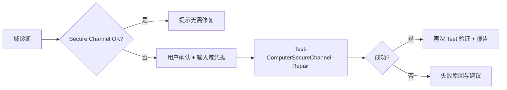

# 域与组策略模块 — 设计方案

> **状态**：已实现（v1）  
> **适用平台**：Windows 10 / 11（本模块不面向 Linux / macOS）  
> **关联项目**：青丘狐网络工作台（`qqhu_network_diagnosis`）  
> **版本**：v1.0（2026-05-21）

---

## 1. 概述

### 1.1 背景

当前工具已在 **安全诊断** 中只读采集域/工作组信息（`Win32_ComputerSystem`），但缺少面向 Active Directory 运维的集中入口。本模块将 **域诊断、策略查看、策略刷新、信任修复** 与 **计算机重命名 / 加域 / 退域** 整合为独立导航页 **「域与策略」**（暂定名）。

**软件一键安装模块** 因安装包静默参数差异过大、维护成本高，**明确不纳入**本阶段范围。

### 1.2 目标

| 目标 | 说明 |
|------|------|
| 诊断优先 | 默认只读；写操作需显式授权与二次确认 |
| 与现有架构一致 | PowerShell 子进程 + 后台线程 + Markdown 报告 + `reports/` 导出 |
| 最小权限 | 加域后指定域用户加入本地 **Power Users**，**不**加入 **Administrators** |
| 可审计 | 操作记录写入 Markdown 报告与 `logs/app.log`（**不含密码**） |

### 1.3 非目标

- Azure AD Join / Hybrid Join / Intune 注册（仅传统 **Active Directory** 域）
- 远程对其他计算机执行加域 / gpupdate（`Invoke-GPUpdate` 远程）
- 修改域控或 AD 对象（创建 OU、预置计算机账户等高级操作仅通过参数支持 `-OUPath`，不做完整 AD 管理 UI）
- 编辑 / 下发 GPO（仅 **本机查看** 与 **本机刷新**）
- AI 助手自动调用写操作（加域、退域、改名、修复信任、gpupdate **禁止** 作为 function tool 默认可用）

---

## 2. 功能清单

| # | 功能 | 类型 | 需管理员 | 通常需重启/注销 |
|---|------|------|----------|-----------------|
| 1 | **域诊断** | 只读 | 否（部分项建议提权） | 否 |
| 2 | **查看域策略（本机）** | 只读 | 否 | 否 |
| 3 | **更新域策略** | 写 | 是（计算机策略） | 可能（注销/重启） |
| 4 | **域信任修复** | 写 | 是 | 一般否 |
| 5 | **计算机重命名** | 写 | 是 | **是（必须重启）** |
| 6 | **加入域** | 写 | 是 | **是（必须重启）** |
| 7 | **退出域** | 写 | 是 | **是（必须重启）** |

---

## 3. 模块架构

### 3.1 目录结构（建议）

```text
network_diagnosis/
  domain/                          # 新建包
    __init__.py
    models.py                      # 诊断/操作结果 dataclass
    collect.py                     # 只读：域诊断、gpresult
    operations.py                  # 写：改名、加域、退域、信任修复、gpupdate
    report_md.py                   # Markdown 渲染
    elevation.py                   # 管理员检测、可选提权重启引导
  gui/
    domain_frame.py                # 域与策略页 UI
docs/
  domain-module-design.md          # 本文档
reports/
  domain_ops/<任务ID>/             # 每次诊断或操作的报告与 gpresult.html
config/
  domain_ops.json                  # 可选：默认域 DNS 名、默认工作组名等（不含密码）
```

### 3.2 与现有代码关系

| 现有 | 关系 |
|------|------|
| `security_diag/local_machine.py` | 域/工作组只读表格可 **迁移或复用** 至 `domain/collect.py`，安全诊断保留简要摘要或链接 |
| `security_diag/collect.py` 中 `_run_powershell` | 抽到 `domain/` 或公共 `subprocess_win.py` 复用，避免三处复制 |
| `paths.py` | 新增 `domain_ops_report_dir(task_id)`、`domain_ops_config_path()` |
| `gui/main_app.py` | 侧边栏增加 `("domain", "域与策略")` 导航项 |
| `gui/dhcp_diagnosis_frame.py` | UI 模式参考：上操作区 + 下 Markdown 输出 + 后台线程 + 报告导出 |

### 3.3 执行模型

- 所有 PowerShell / `gpupdate` / `gpresult` 在 **工作线程** 执行，通过 `queue` 回传 UI（与 DHCP 诊断一致）。
- 写操作前：**检测是否管理员** → 未提权则提示「以管理员身份重新运行本程序」或使用 `ShellExecuteW` `runas` 启动提权子进程（二选一，首版推荐前者，实现简单）。
- 凭据：**不得**写入日志与 Markdown；使用 Windows 凭据对话框或 `-Credential (Get-Credential)` 交互（GUI 弹窗输入域用户/密码，内存中 `SecureString` 传递后立即释放）。

---

## 4. 功能详细设计

### 4.1 域诊断（只读）

**目的**：一次性输出本机与 AD 相关的健康检查，供运维人员判断能否加域、是否需要修复信任或刷新策略。

**采集项**：

| 类别 | 内容 | 实现要点 |
|------|------|----------|
| 身份 | 计算机名、DNS 主机名、域/工作组、`PartOfDomain` | `Get-CimInstance Win32_ComputerSystem`、`Win32_ComputerSystemProduct` |
| 安全通道 | Secure Channel 是否正常 | `Test-ComputerSecureChannel` |
| 域控定位 | 当前登录域 DC、IP | `nltest /dsgetdc:<域名>` 或 `[System.DirectoryServices.ActiveDirectory.Domain]::GetCurrentDomain()` |
| DNS | 域 DNS 后缀、SRV 记录 `_ldap._tcp.dc._msdcs.<域>` | `nslookup -type=SRV ...` |
| 网络 | 域控 IP 的 Ping、389/445 端口 TCP（可选） | 复用现有 tcping / socket |
| 时间 | 本机时间与域的时间偏差 | `w32tm /query /status`；偏差 >5 分钟告警 |
| 策略摘要 | 上次组策略应用时间（若可读） | 注册表或 `gpresult /r` 解析 |
| 待重启 | CBS / Windows Update / 域改名 pending reboot | `PendingFileRenameOperations`、WMI `Win32_ComputerSystem` 等启发式 |

**输出**：

- 界面 Markdown 摘要（结论 + 建议）
- 导出 `reports/domain_ops/<task_id>/report.md`
- 可选附带 `diagnosis.json` 结构化结果

**结论示例**：

- 「未加入域」→ 引导使用「加入域」
- 「Secure Channel 失败」→ 引导「域信任修复」
- 「无法解析 SRV / 无法 Ping 域控」→ 引导检查 DNS/VPN/防火墙
- 「时间偏差过大」→ 引导同步时间后再修复信任

---

### 4.2 查看域策略（本机）

**目的**：查看 **本机已生效** 的组策略结果，**不**连接域控修改 GPO。

**实现**：

| 命令 | 用途 |
|------|------|
| `gpresult /r` | 简明文本：应用的 GPO 列表、用户/计算机范围 |
| `gpresult /r /v` | 详细（可选，体积大） |
| `gpresult /h "<path>\gpresult.html"` | **HTML 报告**（推荐默认导出，便于浏览器查看） |
| `gpresult /scope user` | 仅当前用户策略 |
| `gpresult /scope computer` | 仅计算机策略 |

**UI**：

- 单选：**用户策略 / 计算机策略 / 两者**
- 按钮：**生成报告** → 后台执行 → Markdown 区显示 `gpresult /r` 摘要 + 「在浏览器中打开 HTML」链接
- HTML 与 `report.md` 保存至 `reports/domain_ops/<task_id>/`

**说明文案**（内置帮助）：

> 本功能仅反映 **本机当前登录上下文** 下的 resultant policy。未加入域时主要为本地 GPO；已入域时为域 GPO + 本地 GPO 合并结果。精细策略定义请在域控 GPMC 或本机 `gpedit.msc` 查看。

**权限**：普通用户可查看 **用户策略**；**计算机策略** 部分环境需管理员，`gpresult` 失败时在报告中说明。

---

### 4.3 更新域策略

**目的**：强制刷新组策略，使域/本地 GPO 尽快生效。

**实现**：

```text
gpupdate /force /wait:0
```

可选分目标：

```text
gpupdate /target:computer /force /wait:0
gpupdate /target:user /force /wait:0
```

**UI**：无范围选项；固定执行 `gpupdate /force /wait:0`（**本机计算机策略 + 当前登录用户策略**）。完成后解析输出中的 logoff/reboot 建议。

**gpupdate 输出处理**：

- 若包含 *「用户策略更新成功，但需要重新登录」* → 提示 **注销后生效**
- 若包含 *「计算机策略更新成功，但需要重启」* → 提示 **重启后生效**
- 失败时记录 exit code 与 stderr 片段

**权限**：刷新 **计算机策略** 必须管理员；首版统一要求管理员运行写操作。

**风险**：低～中（策略立即生效，可能改变防火墙、软件限制等；不破坏域成员身份）。

---

### 4.4 域信任修复

**目的**：修复「工作站与主域之间的信任关系失败」类问题（Secure Channel / 机器密码不同步）。

**流程**：



**PowerShell（概念）**：

```powershell
Test-ComputerSecureChannel -Verbose
$cred = Get-Credential  # 域账户，需有「域加入」相关权限或对该计算机对象有 Reset Password 权限
Test-ComputerSecureChannel -Repair -Credential $cred
Test-ComputerSecureChannel  # 验证
```

**备选**：`netdom resetpwd /server:<DC> /userd:<域\User> /passwordd:*`（当 Repair 不可用时的兜底，文档中注明）。

**前置检查**（诊断阶段已完成）：

- 已入域
- 能解析并连通域控
- 系统时间正确

**权限**：管理员 + 有效域凭据。

**副作用**：一般 **不需要重启**；失败时勿重复盲目 Repair。

---

### 4.5 计算机重命名

**目的**：修改 NetBIOS/计算机名；**完成后必须重启** 才完全生效。

**流程**：

1. 显示当前计算机名
2. 输入新名称（校验：≤15 字符 NetBIOS 规则、合法字符 `A-Z0-9-`）
3. 若 **已入域**：需 **域凭据**（有「重命名计算机账户」权限）
4. 二次确认：「重命名后需要 **重启计算机**」
5. 执行 `Rename-Computer`
6. 成功后：**引导重启**（见 §5.2）

**PowerShell（概念）**：

```powershell
# 工作组或未入域
Rename-Computer -NewName "PC-NEW" -Force

# 已入域
Rename-Computer -NewName "PC-NEW" -DomainCredential $cred -Force
```

**注意**：

- 已入域改名会同步 AD 计算机账户名（需权限）；可能与 GPO、SCCM、证书 SAN 等耦合，界面需 **高风险警告**
- 执行后 `PendingComputerRename` / 重启标志应被诊断页识别

**不提供** `-Restart` 自动重启（见 §5.2：由用户确认后手动或一键调用 `shutdown /r /t 60`）。

---

### 4.6 加入域

**目的**：将本机加入指定 AD 域；加域成功后 **必须重启**；并将 **指定域用户** 加入本地 **Power Users**，**不**加入 **Administrators**。

#### 4.6.1 表单字段

| 字段 | 必填 | 说明 |
|------|------|------|
| 域 DNS 名 | 是 | 如 `corp.example.com` |
| 加域凭据 | 是 | 有权「将计算机加入域」的域账户 |
| 计算机 OU（可选） | 否 | `Add-Computer -OUPath "OU=...,DC=..."` |
| 加域后要授权登录的域用户 | 是 | 如 `CORP\zhangsan`（**不含**于 Domain Admins 的日常工作账户） |
| 重启前本地管理员检查 | 建议 | 提示确认存在可用的本地 Administrator 或已缓存凭据 |

#### 4.6.2 执行步骤

```text
1. 前置：域诊断通过（DNS、SRV、Ping 域控、时间）
2. Add-Computer -DomainName <域> -Credential <加域凭据> [-OUPath <OU>] -Force -PassThru
3. 将「加域后要授权登录的域用户」加入本地组 Power Users：
     Add-LocalGroupMember -Group "Power Users" -Member "DOMAIN\user"
4. 显式检查：若该用户已在 Administrators，则 Remove-LocalGroupMember（可选策略，见下）
5. 报告成功，引导重启
```

**PowerShell（概念）**：

```powershell
Add-Computer -DomainName "corp.example.com" -Credential $joinCred -OUPath "OU=Workstations,DC=corp,DC=example,DC=com" -Force -PassThru

Add-LocalGroupMember -Group "Power Users" -Member "CORP\zhangsan"
# 若误在 Administrators 中则移除（仅针对指定用户，不触碰 Domain Admins 组）
if (Get-LocalGroupMember -Group Administrators -Member "CORP\zhangsan" -ErrorAction SilentlyContinue) {
    Remove-LocalGroupMember -Group Administrators -Member "CORP\zhangsan"
}
```

#### 4.6.3 关于 Power Users 与 Administrators 的说明

| 项 | 说明 |
|----|------|
| **Power Users** | 组 SID `S-1-5-32-547`；Vista 起许多特权已回收，**不能**等同管理员，但仍高于标准用户（如部分驱动/程序安装场景，视系统版本而定） |
| **Domain Admins** | Windows 加域后通常会将 **Domain Admins** 全局组加入本地 **Administrators**（默认行为）。本模块 **不自动移除 Domain Admins**，以免影响 IT 运维；仅保证 **指定的普通域用户** 在 Power Users 且 **不在** Administrators |
| **加域凭据** | 执行加域的账户常为域管理员，**不会**因此自动把该账户加入本地 Administrators（除非该账户属于 Domain Admins 且已通过组嵌套获得管理员权限） |

界面 **合规提示** 需写清上述区别，避免用户误以为「Power Users = 无限制管理员」。

#### 4.6.4 限制

- 不支持离线加域（`djoin`）首版不做
- 已入域时需先退域或提示冲突

---

### 4.7 退出域

**目的**：脱离 AD 域并加入指定工作组；**必须重启**。

#### 4.7.1 表单字段

| 字段 | 必填 | 说明 |
|------|------|------|
| 退域凭据 | 是 | 有权从域中删除/禁用计算机对象的域账户 |
| 目标工作组名 | 是 | 默认 `WORKGROUP` |
| 本地管理员确认 | 是 | 勾选「已确认存在可用本地 Administrator 或已知本地管理员密码」 |

#### 4.7.2 执行

```powershell
Remove-Computer -UnjoinDomainCredential $cred -WorkgroupName "WORKGROUP" -Force -PassThru
```

#### 4.7.3 风险与 UI 要求

- **最高风险** 写操作：误退域可能导致无法使用域账户登录
- 必须 **二次确认** + 红色警告框
- 退域前可选运行诊断：列出本地可登录用户（`Get-LocalUser | Where Enabled`）
- 成功后引导重启（§5.2）

---

## 5. 重启与注销引导

### 5.1 原则

- **Rename-Computer / Add-Computer / Remove-Computer** 均需要重启；**不在未告知用户的情况下自动重启**。
- **gpupdate** 仅按输出提示建议注销/重启。
- **域信任修复** 通常无需重启。

### 5.2 UI 行为（重启引导）— **已定稿**

改名 / 加域 / 退域成功后，**统一**弹窗询问是否重启；**不静默自动重启**。

操作成功且检测到 pending reboot 时：

1. 弹窗：**「操作已成功，需要重启计算机后完全生效。是否现在重启？」**
   - **立即重启**（**60 秒倒计时，可取消**）：`shutdown /r /t 60 /c "青丘狐网络工作台：域操作需要重启"`
   - **稍后手动重启**（关闭弹窗即可，报告内仍保留重启提醒）
2. Markdown 报告末尾固定段落：

```markdown
## 后续操作

- **必须重启计算机**后，加域/退域/重命名才会完全生效。
- 重启前请保存其他工作。
```

### 5.3 可选增强（二期）

- 检测 `HKLM\...\WindowsUpdate\Auto Update\RebootRequired` 等 pending 标志并在 **域诊断** 中展示

---

## 5A. 侧边栏图标规范

实现时在 `network_diagnosis/images/` 放置透明底 PNG，并在 `paths.resolve_sidebar_nav_icon_png` 中注册 `module_key = "domain"`。

| 项 | 约定 |
|----|------|
| **显示尺寸** | 侧边栏缩放为 **20×20** px（见 `main_app.py`） |
| **源图建议** | 24～32 px 或 SVG 导出 PNG；满幅构图，少留白（除「数字签名」外一般不做 trim） |
| **配色** | 与现有导航一致：**单色金色/琥珀色** glyph + **透明底**（参考同目录 `mdi--server-network.png`、`ion--shield-checkmark.png`） |
| **风格** | **实心 / filled / bold** 线型，小尺寸下可辨认；避免多色、渐变、细线 outline |
| **文件名** | `{图标集}--{名称}.png`，如 `mdi--domain.png` |
| **语义** | 表达 **Active Directory / 域 / 企业网络身份**，与相邻模块区分（见下） |

**与已有图标的区分：**

| 已有模块 | 现有图标语义 | 域模块应避免 |
|----------|--------------|--------------|
| DHCP 诊断 | 服务器 + 网线（`mdi--server-network`） | 再做一个「纯服务器」易混淆 |
| 安全诊断 | 扫描（`simple-icons--scan`） | 单独盾牌 |
| ARP 安全 | 盾牌勾（`ion--shield-checkmark`） | 再强调「安全盾」 |
| 网络诊断 | Wi‑Fi / 网络（`material-symbols--network-wifi`） | 通用无线网络 |

**推荐图标方向（任选其一，Iconify / Material / MDI 等均可）：**

1. **首选 — 域 / AD**：`mdi:domain`、`mdi:microsoft-active-directory`、`material-symbols:domain`  
   → 文件名示例：`mdi--domain.png` 或 `mdi--microsoft-active-directory.png`
2. **备选 — 域 + 策略**：`fluent:globe-shield-24-filled`、`mdi:server-security`  
   → 适合强调 GPO / 信任，但与 ARP/安全略近
3. **备选 — 企业组织**：`fluent:building-government-24-filled`、`carbon:network-enterprise`  
   → 偏「入域 / 组织身份」

**不建议**：Windows 四色窗格 Logo、Microsoft 商标原样、与 `mdi--server-network` 过于相似的「双机架 + 横线」造型。

---

## 6. 权限、安全与审计

### 6.1 权限矩阵

| 操作 | 本地管理员 | 域凭据 |
|------|------------|--------|
| 域诊断 | 推荐 | 否 |
| 查看域策略 | 部分需 | 否 |
| gpupdate（计算机） | **必须** | 否 |
| 信任修复 | **必须** | **必须** |
| 重命名（已入域） | **必须** | **必须** |
| 加域 | **必须** | **必须**（加域账户） |
| 退域 | **必须** | **必须** |

### 6.2 凭据安全

- 密码 **不** 写入 `logs/`、`reports/`、界面历史
- 日志仅记录：`operation=join_domain domain=corp.example.com user=CORP\joinsvc result=success`
- 建议使用 `CredUIPromptForWindowsCredentials` 或 PowerShell `Get-Credential` 一次性输入

### 6.3 AI 助手

| 能力 | 是否暴露为 tool |
|------|-----------------|
| 域诊断 | 可（只读） |
| 查看域策略 | 可（只读） |
| gpupdate / 修复 / 加退域 / 改名 | **否**（或需 `dangerous_ops` 显式开关且二次人工确认） |

---

## 7. GUI 线框（建议）

```text
┌─ 域与策略 ─────────────────────────────────────────────────────┐
│ [合规提示 Labelframe：写操作需授权、退域高风险…]                │
├──────────────────────────────────────────────────────────────┤
│ 当前状态：PC-001 | corp.example.com | 已入域 | SC: 正常          │
├──────────────────────────────────────────────────────────────┤
│ [域诊断] [查看域策略] [更新域策略] [修复域信任]                  │
│ [计算机重命名] [加入域] [退出域]                                 │
├──────────────────────────────────────────────────────────────┤
│ （动态表单区：根据所选操作展开，如域名字段、新计算机名、凭据…）    │
│ [执行] [取消]                                                    │
├──────────────────────────────────────────────────────────────┤
│ Markdown 输出区（进度 / 结果 / 建议）                            │
│ [导出报告] [打开报告目录] [在浏览器中打开 gpresult.html]         │
└──────────────────────────────────────────────────────────────┘
```

- 写操作按钮使用 `bootstyle=WARNING` / `danger` 区分风险等级
- 运行中禁用重复点击，显示 indeterminate 进度条（与安全诊断/DHCP 一致）

---

## 8. 报告与路径约定

### 8.1 报告目录

```text
reports/domain_ops/<YYYYMMDD_HHMMSS>_<short_id>/
  report.md              # 人类可读摘要
  gpresult.html          # 查看域策略时生成（可选）
  gpresult_stdout.txt    # gpresult /r 原始输出
  diagnosis.json         # 域诊断结构化数据（可选）
  operation.json         # 写操作元数据（不含密码）
```

### 8.2 `paths.py` 新增（实现时）

```python
def domain_ops_report_dir(task_id: str) -> Path: ...
def domain_ops_config_path() -> Path: ...  # 默认域名、工作组名等
```

### 8.3 配置 `config/domain_ops.json`（可选）

```json
{
  "default_domain_dns": "corp.example.com",
  "default_workgroup": "WORKGROUP",
  "post_join_local_group": "Power Users"
}
```

`post_join_local_group` 固定为 `Power Users`，一般不允许 UI 改为 Administrators（若未来需可配置，须加高级开关）。

---

## 9. 实现分期

### Phase 1 — 只读（低风险，优先）

- [ ] `domain/collect.py`：域诊断
- [ ] `gpresult /r` + `/h`：查看域策略
- [ ] GUI 框架 + 报告导出
- [ ] 复用/迁移 `security_diag` 中域信息表格

### Phase 2 — 低风险写操作

- [ ] `gpupdate /force`
- [ ] `Test-ComputerSecureChannel -Repair`
- [ ] 管理员检测与提示

### Phase 3 — 高风险写操作

- [ ] 计算机重命名 + 重启引导
- [ ] 加入域 + Power Users 赋权
- [ ] 退出域 + 本地账户检查 + 重启引导

### Phase 4 —  polish

- [ ] 内置帮助页（`main_app_static_views.py`）
- [ ] README 功能表增加「域与策略」一行
- [ ] AI 只读 tools（域诊断摘要）

---

## 10. 命令与 API 速查

| 场景 | 命令 / API |
|------|------------|
| 域身份 | `Get-CimInstance Win32_ComputerSystem` |
| 安全通道 | `Test-ComputerSecureChannel [-Repair] -Credential $cred` |
| 查 DC | `nltest /dsgetdc:<域名>` |
| 加域 | `Add-Computer -DomainName ... -Credential ... [-OUPath ...]` |
| 退域 | `Remove-Computer -UnjoinDomainCredential ... -WorkgroupName ...` |
| 改名 | `Rename-Computer -NewName ... [-DomainCredential ...]` |
| 本地组 | `Add-LocalGroupMember -Group "Power Users" -Member "DOMAIN\user"` |
| 刷新策略 | `gpupdate /force /wait:0` |
| 查看策略 | `gpresult /r`、`gpresult /h report.html` |
| 重启 | `shutdown /r /t 60`（用户确认后） |

---

## 11. 测试计划（实现后）

| 场景 | 预期 |
|------|------|
| 工作组机器 — 域诊断 | 显示未入域，DC/SRV 检查按填写域名可选测 |
| 已入域 — Secure Channel 正常 | 修复按钮提示无需修复 |
| 已入域 — 模拟 SC 失败（实验环境） | Repair 成功，再次诊断为正常 |
| gpupdate | 报告含成功/需注销/需重启提示 |
| gpresult HTML | 浏览器可打开，路径在 report.md 中可点击 |
| 加域（VM 快照） | 重启后 `PartOfDomain=True`，指定用户在 Power Users 且不在 Administrators |
| 退域 | 重启后回到工作组，域用户无法登录 |
| 改名 | 重启后计算机名更新 |
| 非管理员运行写操作 | 明确错误，不静默失败 |
| 凭据错误 | 友好中文错误，密码不出现在日志 |

---

## 12. 开放问题

1. **Power Users 的实际权限** 是否满足客户现场「比普通用户高、比管理员低」的预期？若不够，是否改为自定义本地组 + GPO 模板（超出本模块范围）。
2. **加域 OU 路径** 是否提供「浏览 AD」还是仅文本框粘贴 DN？
3. 是否需要在加域前 **自动创建/检查本地 Administrator 启用**（`net user administrator /active:yes`）— 安全争议大，默认 **不做**。
4. 提权方式：仅提示管理员重启 exe，还是支持 UAC `runas` 子进程？

---

## 13. 修订记录

| 版本 | 日期 | 说明 |
|------|------|------|
| v1.0 | 2026-05-21 | 初稿：域模块全功能方案；明确不做软件安装模块 |
| v1.1 | 2026-05-21 | 定稿：改名/加域/退域成功后弹窗 + `shutdown /r /t 60`；补充侧边栏图标规范 |
