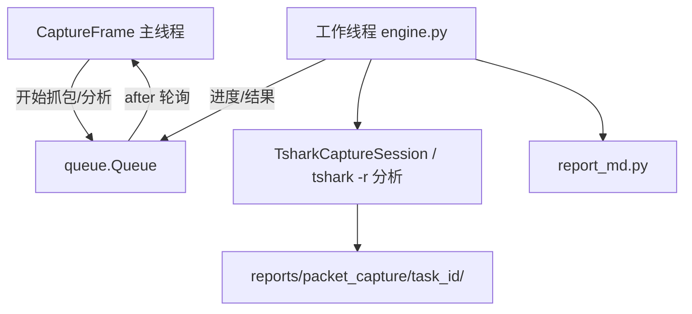

# 抓包分析模块 — 设计方案

> **状态**：已实现（v1）  
> **适用平台**：Windows 10 / 11（本模块不面向 Linux / macOS）  
> **关联项目**：青丘狐网络工作台（`qqhu_network_diagnosis`）  
> **版本**：v1.0（2026-05-26）

---

## 1. 概述

### 1.1 背景

当前 **网络诊断** 模块已支持在诊断过程中 **可选勾选「抓包」**：由 `runner.py` 按目标主机/端口自动构建 BPF，调用 `tshark` 写入 `pcapng`，结束后调用 `summarize_pcap()` 生成面向非技术人员的中文摘要。该能力 **与单次诊断任务绑定**，缺少：

- 用户自选网卡、自定义 BPF、独立起停的 **专项抓包** 入口；
- **导入历史 pcap/pcapng** 做离线分析；
- 比 `summarize_pcap` 更丰富的 **结构化统计与报文预览**；
- 与 DHCP 诊断、ARP 安全等模块 **横向对照** 的集中入口。

本模块将上述能力整合为独立导航页 **「抓包分析」**，与网络诊断 **互补**：诊断页负责「测连通性时顺带抓包」；本页负责「主动采集、离线分析、深度统计」。

### 1.2 目标

| 目标 | 说明 |
|------|------|
| 独立可用 | 不依赖网络诊断任务即可抓包或分析已有文件 |
| 与现有架构一致 | `tshark` 子进程 + 后台线程 + `queue` 回灌 UI + Markdown 报告 + `reports/` 导出 |
| 最大复用 | 底层调用 `probes/tshark.py`（`TsharkCaptureSession`、`summarize_pcap` 等），**不**引入 scapy / pyshark |
| 双轨输出 | GUI 中文摘要（普通用户）+ Markdown 技术报告（运维/留档） |
| 合规可审计 | 顶部固定授权与隐私提示；日志记录任务元数据，**不**记录报文载荷内容 |
| 性能可控 | 大文件分页/抽样分析，避免 tkinter 主线程阻塞或内存暴涨 |

### 1.3 非目标

- **不** 在应用内复刻 Wireshark 完整 GUI（海量报文实时渲染、十六进制编辑器、Follow Stream 等）
- **不** 实现 TLS 解密（需 key log / 私钥，合规与维护成本高）
- **不** 引入 Python 抓包库（scapy、pyshark、pypcap 等）作为运行时依赖
- **不** 允许 AI 助手 **自动启动** 网卡抓包（仅只读分析已有文件或报告摘要，见 §6.3）
- **不** 远程抓包、分布式多机采集（仅本机 Npcap 可见接口）
- **不** 修改或注入网络流量（只读采集与分析）

---

## 2. 功能清单

| # | 功能 | 类型 | 需管理员 | 阶段 |
|---|------|------|----------|------|
| 1 | **实时抓包**（选网卡、BPF、手动/定时停止） | 写（采集） | 部分环境必须 | MVP |
| 2 | **导入 pcap/pcapng 离线分析** | 只读 | 否 | MVP |
| 3 | **自动中文摘要**（扩展 `summarize_pcap`） | 只读 | 否 | MVP |
| 4 | **导出 Markdown 报告 + 打开报告目录** | 只读 | 否 | MVP |
| 5 | **用 Wireshark 打开当前文件** | 只读（启动外部程序） | 否 | MVP |
| 6 | **从网络诊断历史载入 pcap** | 只读 | 否 | v1.1 |
| 7 | **Display Filter 再分析** | 只读 | 否 | v1.1 |
| 8 | **报文预览表**（分页/限条） | 只读 | 否 | v1.1 |
| 9 | **Expert / RST / 重传 / DNS 等专项统计** | 只读 | 否 | v1.1 |
| 10 | **配置持久化**（上次网卡、BPF 模板） | 只读/写配置 | 否 | v1.1 |
| 11 | **分析结果 JSON + 历史任务列表** | 只读 | 否 | v1.2 |
| 12 | **AI 只读解读分析摘要** | 只读 | 否 | v1.2 |

---

## 3. 模块架构

### 3.1 目录结构

```text
network_diagnosis/
  capture/                         # 新建包
    __init__.py
    models.py                      # CaptureSessionResult, PcapAnalysisResult 等
    engine.py                      # 编排：实时抓包会话、离线分析流水线
    analyze.py                     # 扩展分析（协议树、会话、Expert、报文预览）
    report_md.py                   # Markdown 报告渲染与写入
    config.py                      # load/save config/packet_capture.json
    iface.py                       # 网卡列表解析（封装 tshark -D，可复用 tshark.py 评分逻辑）
  probes/
    tshark.py                      # 保留：底层抓包会话、summarize_pcap（capture/ 调用，必要时小幅抽取公共函数）
  gui/
    capture_frame.py               # 抓包分析页 UI
docs/
  packet-capture-design.md         # 本文档
reports/
  packet_capture/<任务ID>/         # 每次抓包或分析任务的产物
config/
  packet_capture.json              # 可选：默认网卡索引、BPF 模板、分析上限等
```

### 3.2 与现有代码关系

| 现有 | 关系 |
|------|------|
| `probes/tshark.py` | **直接复用** `TsharkCaptureSession`、`pick_capture_interface_index`（默认推荐）、`summarize_pcap`、`tshark_version_line`；`analyze.py` 新增统计时统一经 `run_to_log_files` |
| `runner.py` 中 `_build_capture_filter` | **不迁移**；本模块 BPF 由用户输入。可从诊断页 **预填** 主机/端口生成的表达式（v1.1 联动） |
| `model/report.py` 中 `CaptureInfo` | **保留** 供网络诊断报告使用；本模块使用 `capture/models.py` 独立模型，字段可对齐但 **不强行合并** |
| `paths.find_tshark()` | MVP 沿用 Program Files 探测；**v1.2 可选** 扩展 `ThirdParty/Wireshark/tshark.exe` |
| `gui/main_app.py` | 侧边栏增加 `("packet_capture", "抓包分析")`；注册 `CaptureFrame`；复用 `_open_wireshark_installer` |
| `gui/dhcp_diagnosis_frame.py` | UI 模式参考：合规提示 + 参数区 + Panedwindow 结果区 + 后台线程 + 报告导出 |
| `gui/main_app_static_views.py` | 内置帮助增加「抓包分析」章节（Phase 4） |
| `ai/tools.py` | v1.2 可选只读 tool（见 §6.3） |

### 3.3 执行模型



- 所有 `tshark` 调用在 **工作线程** 执行；UI 通过 `queue` + `after(180, _poll_queue)` 更新（与 DHCP 诊断一致）。
- 抓包进行中 **禁止** 在主线程调用 `tshark -r` 统计帧数；帧数刷新由工作线程周期性推送或停止后一次性统计。
- 用户离开页面时：见 §4.6 **页面生命周期**。
- 取消/停止：对抓包子进程发送 `CTRL_BREAK`（复用 `_request_tshark_stop`），**禁止** `TerminateProcess` 硬杀以免 pcap 损坏。

---

## 4. 功能详细设计

### 4.1 前置条件与合规提示（固定顶部）

**Labelframe「合规与依赖提示」**（`bootstyle=WARNING`），内容要点：

1. **依赖**：本机须安装 **Wireshark**（含 **Npcap**）；程序通过 `find_tshark()` 定位 `tshark.exe`。未检测到时显示警告，并提供 **「安装 Wireshark」** 按钮（调用现有 `iter_wireshark_installers()` / `_open_wireshark_installer`）。
2. **权限**：部分环境须 **以管理员身份运行** 本程序，否则 Npcap 无法打开适配器；抓包失败时报告区展示 `tshark` stderr 末尾片段（与 `runner.py` 一致）。
3. **授权与隐私**：抓包可能包含账号、Cookie、内网地址等敏感信息；**仅** 在已获得授权的网络中使用；勿将 pcap 外传至未授权方。
4. **磁盘**：长时间或无过滤器抓包可能产生 **GB 级** 文件；建议设置文件大小上限或较短定时。

**状态条**（参数区下方）：`tshark` 路径摘要、版本行（`tshark_version_line`）、当前任务状态（空闲 / 抓包中 / 分析中）。

---

### 4.2 实时抓包

#### 4.2.1 参数

| 控件 | 变量/类型 | 说明 |
|------|-----------|------|
| 网卡 | `Combobox(readonly)` | `tshark -D` 列出；默认选中 `pick_capture_interface_index` 推荐项，**允许用户覆盖** |
| BPF 捕获过滤器 | `Entry` 或多行 `Text` | 传给 `tshark -f`；空表示 **无 BPF**（见 §4.2.3） |
| BPF 模板 | 下拉或按钮组 | 预设：`host <IP>`、`tcp port <N>`、`udp port 53`、`icmp`、`not broadcast and not multicast` |
| 停止方式 | `Radiobutton` | **手动停止**（默认）/ **定时 N 秒** |
| 定时秒数 | `Spinbox` | 5～3600，默认 60；到时工作线程自动 `stop()` |
| 文件大小上限 | `Spinbox` + 勾选 | 可选；对应 `tshark -a filesize:<KB>`，默认关闭，上限建议 50～500 MB |
| 输出文件名 | 只读标签 | 固定为报告目录内 `capture_<task_id>.pcapng` |

#### 4.2.2 抓包命令（概念）

```text
tshark -i <iface_idx> -w <pcap_path> [-f "<bpf>"] [-a filesize:<kb>] [-a duration:<sec>]
```

- MVP 实现：**手动停止** 时不传 `-a duration`；**定时** 时在启动参数加 `-a duration:N`，到点 tshark 自行退出，工作线程 `wait` 后进入分析。
- 文件大小上限与定时 **可同时** 启用（任一条件先到先停）。

#### 4.2.3 空 BPF 策略（已定）

- 允许用户不填 BPF 进行全量抓包（Npcap 可见的全部流量），但点击 **「开始抓包」** 时必须 **二次确认**：
  > 未设置捕获过滤器将抓取网卡上的大量流量，可能包含敏感信息并占用大量磁盘。是否继续？
- 若用户取消，则不启动。
- 配置项 `packet_capture.json` 可提供 `default_bpf`（例如 `not broadcast and not multicast`），启动时预填 Entry，**不** 强制覆盖用户清空行为。

#### 4.2.4 抓包过程 UI

- **开始抓包**：创建 `task_id`，建报告目录，启动 `TsharkCaptureSession`。
- **停止抓包**：调用 `session.stop()`，然后 **自动触发** 离线分析（§4.4）。
- 抓包中：**禁用** 开始按钮，启用停止按钮；状态栏显示已运行时长；可选每 3～5 秒由工作线程推送 **文件大小**（`pcap_path.stat().st_size`），**不在** 抓包中频繁 `-r` 数帧。
- 失败：展示 stderr 日志路径与末尾摘要；`CaptureSessionResult.status = failed`。

---

### 4.3 离线导入

| 控件 | 说明 |
|------|------|
| **打开文件…** | `filedialog`，扩展名 `.pcap`、`.pcapng`、`.cap` |
| **从网络诊断载入…** | v1.1：扫描 `reports/` 下 `capture_*.pcapng`（按修改时间倒序），列表选择 |
| **分析** | 对当前选中文件跑 §4.4 流水线（导入后不自动复制；**复制** 到任务目录可选，默认 **复制** 以便报告自包含） |

- 导入分析时 `source = imported`；实时抓包后 `source = live`；从诊断载入 `source = from_diagnosis`。
- 文件不存在或零字节：拒绝分析并提示。
- 大于 **500 MB** 时弹窗确认后再分析（阈值可配置 `max_analyze_bytes`）。

---

### 4.4 分析流水线

分析由 `engine.run_pcap_analysis(...)` 统一编排，输入：`tshark_path`、`pcap_path`、`report_dir`、可选 `display_filter`。

#### 4.4.1 阶段与进度文案

| 顺序 | 阶段 | 实现 |
|------|------|------|
| 1 | 帧数与文件信息 | 文件大小、`tshark -r ... -T fields -e frame.number` 计数（复用 `_count_pcap_frames`） |
| 2 | 中文摘要 | `summarize_pcap()`（MVP 核心输出） |
| 3 | 协议分层 | `-z io,phs` 解析为结构化 dict（v1.1 入 JSON） |
| 4 | TCP/UDP 会话 Top N | 复用/扩展 `_top_tcp_flows_for_family`；v1.1 增加 `-z conv,udp` |
| 5 | 报文预览 | v1.1：`tshark -T fields` 限前 **500** 条（可配置 `preview_limit`） |
| 6 | Expert / 异常 | v1.1：重传、RST、Dup ACK 等计数（见 §4.5） |
| 7 | 写报告 | `analysis.json` + `report.md` |

每阶段通过 `progress_callback(str)` 推送 UI。

#### 4.4.2 Display Filter（v1.1）

- 用户输入 Wireshark 显示过滤器（如 `tcp.flags.reset==1`）。
- **仅影响** 阶段 4～6 的 `-Y` 参数；**不修改** 原始 pcap。
- 空 display filter 表示分析全文件。

---

### 4.5 分析项规格

#### MVP（必须实现）

| 项 | 输出 |
|----|------|
| 总规模 | 帧数、文件大小、抓包时长（首末帧时间差，`-T fields -e frame.time_epoch` 抽样首尾） |
| 协议摘要 | `summarize_pcap` 全文写入 GUI 与 Markdown |
| Top TCP 流 | 已在 `summarize_pcap` 内 |
| 元数据 | 使用的 tshark 路径、命令行、各阶段日志路径 |

#### v1.1（增强）

| 项 | tshark 手段 | GUI 展示 |
|----|-------------|----------|
| 协议树表格 | 解析 `io,phs` | 表格：协议 / 帧数 / 字节数 |
| UDP 会话 Top N | `-z conv,udp` | 列表 |
| TCP 重传 | `-Y tcp.analysis.retransmission` 计数 | 数字 + 若有则告警句 |
| TCP RST | `-Y tcp.flags.reset==1` 计数 | 数字 |
| DNS 查询 | `-Y dns -T fields -e dns.qry.name` 去重 Top 20 | 列表 |
| HTTP 状态码 | `-Y http -T fields -e http.response.code` | 分布摘要（仅明文 HTTP） |
| TLS Client Hello / SNI | `-Y ssl.handshake.type==1 -T fields -e tls.handshake.extensions_server_name` | 去重列表（**不解密**） |
| Expert 摘要 | 解析 `-z expert` 或等效 | 警告条列表 |

#### v1.2（可选）

| 项 | 说明 |
|----|------|
| 随时间 IO 统计 | `-z io,stat,1` 解析，GUI 简单文本趋势或导出 CSV |
| DHCP / ARP 帧计数 | 过滤器 `bootp` / `arp`，与 DHCP/ARP 模块联动说明 |
| 历史任务索引 | `reports/packet_capture/_history.json`（类似 `_diagnosis_history.json`） |

#### 明确不做

- 报文十六进制视图、Follow TCP Stream、解密 TLS
- 单次分析默认加载超过 **2000** 行报文预览（超出提示用 Wireshark 打开）

---

### 4.6 页面生命周期

| 事件 | 行为 |
|------|------|
| `on_show()` | 刷新网卡列表；检测 `tshark`；从 config 加载默认 BPF/网卡 |
| `on_leave()` | 若 **正在抓包**：弹窗三选一 — **继续后台抓包** / **停止并保存** / **取消切换**（默认「继续后台」） |
| 后台抓包中 | 侧栏「抓包分析」按钮旁或窗口标题显示 ● 录制指示；回到该页恢复完整状态 |
| 应用退出 | 若仍在抓包，弹窗确认；确认退出则 `stop()` 并等待最多 45s（与 `TsharkCaptureSession.stop` 一致） |

---

### 4.7 结果展示与操作

**布局**：`Panedwindow(VERTICAL)` — 上：参数与按钮；下：结果（`Notebook` 两个 Tab 推荐）

| Tab | 内容 |
|-----|------|
| **摘要** | Markdown 渲染的中文结论（`simple_markdown_text`） |
| **详情** | v1.1：协议表、会话表、报文预览 `Treeview`；MVP 可仅摘要 |

**底部按钮**：

| 按钮 | 行为 |
|------|------|
| 导出报告 | 写入/刷新 `report.md`（若已写则提示路径） |
| 打开报告目录 | `os.startfile(report_dir)` |
| 用 Wireshark 打开 | 启动 `%ProgramFiles%\Wireshark\Wireshark.exe` + pcap 路径；未安装则提示 |
| 复制摘要 | 剪贴板 |

---

## 5. 数据模型

### 5.1 `capture/models.py`（核心字段）

```python
@dataclass
class CaptureSessionResult:
    task_id: str
    started_at: datetime
    stopped_at: datetime | None
    interface_index: str
    interface_desc: str
    bpf_filter: str
    pcap_path: Path
    file_size_bytes: int
    frame_count: int | None
    status: Literal["running", "stopped", "failed", "cancelled"]
    tshark_stdout_log: Path | None
    tshark_stderr_log: Path | None
    error_message: str

@dataclass
class FlowStat:
    family: Literal["ipv4", "ipv6", "udp"]
    endpoint_a: str  # 展示用，如 "10.0.0.1 端口 443"
    endpoint_b: str
    packet_count: int

@dataclass
class PacketPreviewRow:
    no: int
    time_relative: str
    src: str
    dst: str
    protocol: str
    length: int
    info: str

@dataclass
class ExpertWarning:
    severity: str
    summary: str
    count: int

@dataclass
class PcapAnalysisResult:
    task_id: str
    analyzed_at: datetime
    source: Literal["live", "imported", "from_diagnosis"]
    pcap_path: Path
    display_filter: str | None
    frame_count: int
    file_size_bytes: int
    duration_sec: float | None
    summary_plain: str                    # summarize_pcap 输出
    protocol_hierarchy: dict[str, int]    # v1.1
    top_tcp_flows: list[FlowStat]
    top_udp_flows: list[FlowStat]         # v1.1
    retransmission_count: int | None      # v1.1
    rst_count: int | None                 # v1.1
    dns_queries: list[str]                # v1.1
    tls_sni_list: list[str]               # v1.1
    expert_warnings: list[ExpertWarning]    # v1.1
    packet_preview: list[PacketPreviewRow]  # v1.1
    markdown_path: Path
    analysis_json_path: Path | None
```

`task_id` 格式与 DHCP 诊断一致：`YYYYMMDD_HHMMSS_<uuid8>`。

---

## 6. 权限、安全与 AI

### 6.1 权限

| 操作 | 管理员 |
|------|--------|
| 实时抓包 | **部分环境必须**（Npcap 限制） |
| 离线分析 | 否 |
| 打开 Wireshark | 否 |

### 6.2 日志与隐私

- `logs/app.log` 记录：`task_id`、网卡索引、BPF **字符串**、帧数、文件大小、成功/失败；**不** 记录报文 payload、DNS 完整查询列表（v1.1 详情仅写入任务目录 `analysis.json` / `report.md`）。
- Markdown 报告可含 IP/端口/SNI；导出目录由用户自行管控。

### 6.3 AI 助手

| 能力 | 是否暴露为 tool | 说明 |
|------|-----------------|------|
| 解读已有 `report.md` / 摘要文本 | v1.2 可 | 只读 |
| 对指定 pcap 路径跑分析 | v1.2 可 | 只读；路径须在 `reports/` 下或用户显式提供 |
| **启动网卡实时抓包** | **否** | 避免 AI 误触发大规模采集 |

---

## 7. GUI 线框

```text
┌─ 抓包分析 ─────────────────────────────────────────────────────────────┐
│ [合规与依赖提示 Labelframe]                                              │
│  Wireshark/Npcap · 授权 · 磁盘 · [安装 Wireshark]                         │
├────────────────────────────────────────────────────────────────────────┤
│ 状态：tshark OK · v4.x · 空闲                                            │
├────────────────────────────────────────────────────────────────────────┤
│ [实时抓包]                                                               │
│   网卡 [下拉 ▼]   BPF [________________] [模板▼]                         │
│   停止方式 (•)手动 ( )定时 [60]秒   [ ]文件上限 [100]MB                  │
│   [开始抓包] [停止抓包]                                                    │
├────────────────────────────────────────────────────────────────────────┤
│ [离线分析]                                                               │
│   当前文件：capture_20260526_....pcapng (12.3 MB)                       │
│   [打开文件…] [从网络诊断载入…]  Display Filter [________] (v1.1)       │
│   [分析]                                                                 │
├────────────────────────────────────────────────────────────────────────┤
│ ┌─ 摘要 ─┬─ 详情(v1.1) ─────────────────────────────────────────────┐  │
│ │ ● 规模：…                                                          │  │
│ │ ● 协议：…                                                          │  │
│ │ ● 会话：…                                                          │  │
│ └────────────────────────────────────────────────────────────────────┘  │
│ [导出报告] [打开报告目录] [用 Wireshark 打开] [复制摘要]                  │
└────────────────────────────────────────────────────────────────────────┘
```

- 运行中：禁用「开始抓包」「分析」，显示 indeterminate 进度条（与 DHCP 诊断一致）。
- 导航键：`packet_capture`；显示名：**抓包分析**；图标：`assets` 侧栏图标命名与现有一致（实现时新增 `packet_capture.png`，风格参考现有 mdi 图标）。

---

## 8. 报告与路径约定

### 8.1 报告目录

```text
reports/packet_capture/<YYYYMMDD_HHMMSS>_<short_id>/
  capture_<task_id>.pcapng       # 实时抓包输出；导入分析时可为 copy 或 symlink（Windows 用 copy）
  report.md                      # 人类可读报告
  analysis.json                  # 结构化结果（v1.1 起）
  tshark_capture.stdout.log
  tshark_capture.stderr.log
  pcap_frame_count.stdout.log    # 各分析子步骤日志（stem 与 tshark.py 一致）
  pcap_io_phs.stderr.log
  ...
```

### 8.2 `paths.py` 新增（实现时）

```python
def packet_capture_report_dir(task_id: str) -> Path:
    """单次抓包/分析任务目录：`reports/packet_capture/<task_id>/`。"""
    ...

def packet_capture_config_path() -> Path:
    """用户配置：`config/packet_capture.json`（位于 user_config_dir()）。"""
    ...
```

### 8.3 配置 `config/packet_capture.json`（可选）

```json
{
  "default_interface_index": "",
  "default_bpf": "not broadcast and not multicast",
  "default_duration_sec": 60,
  "default_filesize_limit_mb": 0,
  "preview_limit": 500,
  "max_analyze_bytes": 524288000,
  "confirm_empty_bpf": true
}
```

- `default_filesize_limit_mb`: `0` 表示不限制。
- `confirm_empty_bpf`: 空 BPF 是否二次确认（默认 `true`）。

---

## 9. 与网络诊断的联动（v1.1）

| 场景 | 行为 |
|------|------|
| 诊断完成且存在 `capture_*.pcapng` | 网络诊断结果区增加链接/按钮 **「在抓包分析中打开」** |
| 跳转 | `main_app._select_module("packet_capture")` + `CaptureFrame.load_pcap(path)` |
| 预填 BPF | 可选：将 `_build_capture_filter(target, ports)` 结果复制到抓包页 BPF 框（ **不自动开始抓包** ） |

网络诊断侧 **不删除** 现有「抓包」复选框；两入口长期并存。

---

## 10. 实现分期

### Phase 1 — MVP

- [ ] `capture/models.py`、`engine.py`（实时抓包 + 停止后分析）
- [ ] `capture/report_md.py`
- [ ] `gui/capture_frame.py` 基础 UI
- [ ] `paths.packet_capture_report_dir`
- [ ] `main_app.py` 导航注册
- [ ] 复用 `summarize_pcap`；空 BPF 二次确认
- [ ] 安装 Wireshark 按钮复用

### Phase 2 — v1.1 增强分析

- [ ] `capture/analyze.py`：协议树、UDP 流、RST/重传、DNS、TLS SNI、报文预览
- [ ] Display Filter
- [ ] 从网络诊断载入 pcap + 诊断页跳转
- [ ] `packet_capture.json` 持久化
- [ ] `analysis.json` 导出

### Phase 3 — v1.2 与文档

- [ ] 历史任务索引（可选）
- [ ] AI 只读 tool
- [ ] `main_app_static_views.py` 帮助章节
- [ ] `README.md` 功能表增加「抓包分析」
- [ ] `find_tshark()` 可选 ThirdParty 路径
- [ ] CHANGELOG 条目

---

## 11. tshark 命令速查

| 场景 | 命令 |
|------|------|
| 列网卡 | `tshark -D` |
| 实时抓包 | `tshark -i <idx> -w <file> [-f bpf] [-a filesize:KB] [-a duration:SEC]` |
| 帧数 | `tshark -r <file> -n -T fields -e frame.number` |
| 协议分层 | `tshark -r <file> -n -q -z io,phs` |
| TCP 会话 | `tshark -r <file> -n -q -z conv,tcp` |
| UDP 会话 | `tshark -r <file> -n -q -z conv,udp` |
| 报文预览 | `tshark -r <file> -n -c 500 -T fields -e frame.number -e frame.time_relative -e ip.src -e ip.dst -e _ws.col.Protocol -e frame.len -e _ws.col.Info` |
| 重传 | `tshark -r <file> -n -Y tcp.analysis.retransmission -T fields -e frame.number` |
| RST | `tshark -r <file> -n -Y tcp.flags.reset==1 -T fields -e frame.number` |

所有命令 stderr/stdout 写入任务目录，超时默认 **240s**（大文件可配置至 600s，仅分析阶段）。

---

## 12. 测试计划（实现后）

| 场景 | 预期 |
|------|------|
| 未安装 tshark | 顶部警告；开始抓包禁用或点击后明确提示；安装包按钮可用 |
| 非管理员抓包失败 | stderr 展示权限/Npcap 相关；报告 status=failed |
| 指定 BPF `tcp port 443` | pcap 内主要为 443 流量；摘要含 TCP 占比 |
| 空 BPF + 确认 | 可抓包；文件增大；摘要协议多样 |
| 空 BPF + 取消 | 不启动子进程 |
| 定时 10 秒 | 自动停止并生成 pcap；进入分析 |
| 手动停止 | pcap 可 Wireshark 打开；帧数 > 0 |
| 导入 sample.pcapng | 分析成功；report.md 存在 |
| 文件 > 500MB | 确认框；取消则不分析 |
| 抓包中切换页面选「继续后台」 | 其他页可用；回到抓包页状态正确 |
| 应用退出时抓包中 | 确认后 stop，pcap 不损坏（可打开） |
| 从网络诊断跳转 | 正确载入对应 pcap 路径（v1.1） |
| Display Filter `dns` | 摘要/会话仅 DNS 相关（v1.1） |

---

## 13. 文档与版本

- 实现完成后更新 `CHANGELOG.md`，版本号随 `network_diagnosis/version.py` 发布节奏。
- 本设计文档状态改为 **已实现（v1）** 时，在文首更新日期与 Phase 勾选情况。

---

## 14. 决策记录（定稿）

| 议题 | 决策 |
|------|------|
| 导航名称 | **抓包分析**（`packet_capture`） |
| 依赖 | **仅 tshark**，不引入 scapy/pyshark |
| 空 BPF | **允许**，但必须二次确认 |
| 抓包中离页 | **默认继续后台**，可选停止 |
| 导入大文件 | **500MB** 默认需确认 |
| 报文预览上限 | **500** 条（可配置） |
| AI 抓包 | **禁止** 自动启动 |
| 与诊断抓包 | **并存**，v1.1 增加跳转联动 |
| Wireshark 打开 | 调 **Wireshark.exe**，非 tshark GUI |
